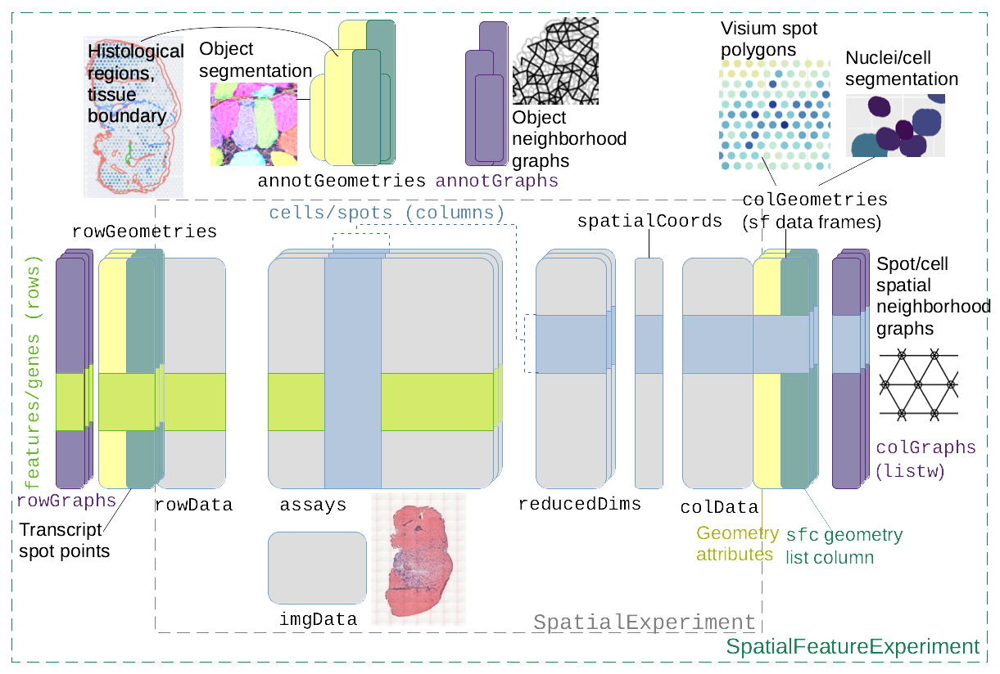

# SpatialFeatureExperiment

<!-- badges: start -->
[](https://lifecycle.r-lib.org/articles/stages.html#experimental)
[](https://codecov.io/gh/pachterlab/SpatialFeatureExperiment)
[](https://github.com/pachterlab/SpatialFeatureExperiment/actions/workflows/R-CMD-check.yaml)
<!-- badges: end -->

## Installation

This package is available on Bioconductor version 3.16 and above. It can be installed with

```r
if (!requireNamespace("BiocManager", quietly = TRUE))
  install.packages("BiocManager")
BiocManager::install("SpatialFeatureExperiment")
```

Documentation can be accessed [on this website](https://pachterlab.github.io/SpatialFeatureExperiment/dev/). 

## Introduction
`SpatialFeatureExperiment` (SFE) is a new [S4](http://adv-r.had.co.nz/S4.html) class built on top of [`SpatialExperiment`](https://bioconductor.org/packages/release/bioc/html/SpatialExperiment.html) (SPE). `SpatialFeatureExperiment` incorporates geometries and geometry operations with the [`sf`](https://cran.r-project.org/web/packages/sf/index.html) package. Examples of supported geometries are Visium spots represented with polygons corresponding to their size, cell or nuclei segmentation polygons, tissue boundary polygons, pathologist annotation of histological regions, and transcript spots of genes. Using `sf`, `SpatialFeatureExperiment` leverages well-established and optimized C++ libraries underlying `sf` for geometry operations, including algorithms for determining whether geometries intersect, finding intersection geometries, buffering geometries with margins, etc. A schematic of the SFE object is shown below:



Below is a list of SFE features that extend the SPE object:

* `colGeometries` are `sf` data frames associated with the entities that correspond to columns of the gene count matrix, such as Visium spots or cells. The geometries in the `sf` data frames can be Visium spot centroids, Visium spot polygons, or for datasets with single cell resolution, cell or nuclei segmentations. Multiple `colGeometries` can be stored in the same SFE object, such as one for cell segmentation and another for nuclei segmentation. There can be non-spatial, attribute columns in a `colGeometry` rather than `colData`, because the `sf` class allows users to specify how attributes relate to geometries, such as "constant", "aggregate", and "identity". See the `agr` argument of the [`st_sf` documentation](https://r-spatial.github.io/sf/reference/sf.html).
* `colGraphs` are spatial neighborhood graphs of cells or spots. The graphs have class `listw` (`spdep` package), and the `colPairs` of `SingleCellExperiment` was not used so no conversion is necessary to use the numerous spatial dependency functions from `spdep`, such as those for Moran's I, Geary's C, Getis-Ord Gi*, LOSH, etc. Conversion is also not needed for other classical spatial statistics packages such as `spatialreg` and `adespatial`.
* `rowGeometries` are similar to `colGeometries`, but support entities that correspond to rows of the gene count matrix, such as genes. A potential use case is to store transcript spots for each gene in smFISH or in situ sequencing based datasets.
* `rowGraphs` are similar to `colGraphs`. A potential use case may be spatial colocalization of transcripts of different genes.
* `annotGeometries` are `sf` data frames associated with the dataset but not directly with the gene count matrix, such as tissue boundaries, histological regions, cell or nuclei segmentation in Visium datasets, and etc. These geometries are stored in this object to facilitate plotting and using `sf` for operations such as to find the number of nuclei in each Visium spot and which histological regions each Visium spot intersects. Unlike `colGeometries` and `rowGeometries`, the number of rows in the `sf` data frames in `annotGeometries` is not constrained by the dimension of the gene count matrix and can be arbitrary.
* `annotGraphs` are similar to `colGraphs` and `rowGraphs`, but are for entities not directly associated with the gene count matrix, such as spatial neighborhood graphs for nuclei in Visium datasets, or other objects like myofibers. These graphs are relevant to `spdep` analyses of attributes of these geometries such as spatial autocorrelation in morphological metrics of myofibers and nuclei. With geometry operations with `sf`, these attributes and results of analyses of these attributes (e.g. spatial regions defined by the attributes) may be related back to gene expression.
* `localResults` are similar to [`reducedDims` in `SingleCellExperiment`](https://bioconductor.org/packages/release/bioc/vignettes/SingleCellExperiment/inst/doc/intro.html#3_Adding_low-dimensional_representations), but stores results from univariate and bivariate local spatial analysis results, such as from [`localmoran`](https://r-spatial.github.io/spdep/reference/localmoran.html), [Getis-Ord Gi\*](https://r-spatial.github.io/spdep/reference/localG.html), AND [local spatial heteroscedasticity (LOSH)](https://r-spatial.github.io/spdep/reference/LOSH.html). Unlike in `reducedDims`, for each type of results (type is the type of analysis such as Getis-Ord Gi\*), each feature (e.g. gene) or pair of features for which the analysis is performed has its own results. The local spatial analyses can also be performed for attributes of `colGeometries` and `annotGeometries` in addition to gene expression and `colData`. Results of multivariate spatial analysis such as [MULTISPATI PCA](https://cran.r-project.org/web/packages/adespatial/vignettes/tutorial.html#multispati-analysis) can be stored in `reducedDims`.

# Citation
Voyager: exploratory single-cell genomics data analysis with geospatial statistics.
Lambda Moses, Pétur Helgi Einarsson, Kayla Jackson, Laura Luebbert, A. Sina Booeshaghi, Sindri Antonsson, Páll Melsted, Lior Pachter
bioRxiv 2023.07.20.549945; doi: https://doi.org/10.1101/2023.07.20.549945
