# Seurat_to_SFE

## Setup

``` r

# set R options, paths, object params, names, functions, etc..
message("Setting options, paths and object params..")
```

    ## Setting options, paths and object params..

``` r

Sys.setenv(LANG = "en")

# To get metadata df from SFE or Seurat object
getMeta <- 
  function(object = NULL) {
    if (class(object) == "Seurat") {
      #is(object, "Seurat")
      # return Seurat metadata
      return(methods::slot(object, name = "meta.data"))
      } else {
        return(colData(object) |> 
                 methods::slot(name = "listData") |> 
                 as.data.frame.list())
      }
    }

# set root dir
dir_extdata <- system.file("extdata", package = "SpatialFeatureExperiment")

# set BPPARAM
BPPARAM <- BiocParallel::MulticoreParam(3,
                                        tasks = 2L,
                                        force.GC = FALSE,
                                        progressbar = TRUE)
```

## Load R packages

``` r

suppressPackageStartupMessages({
    library(ggplot2)
    #library(SingleCellExperiment)
    library(scater)
    library(scuttle)
    library(Seurat)
    #library(SeuratData)
    #library(dplyr)
    library(magrittr)
    #library(scales)    
    #library(spatstat)
    library(patchwork)
    #library(Matrix)
    #library(SpatialExperiment)
    library(Voyager)   
    library(SpatialFeatureExperiment)
    library(SFEData)
    #library(terra)
    #library(BiocParallel)
    #library(sf)    
    })
```

## Load Seurat v5 objects - 1 sample

Note, these object were generated a priori, object names with (eg
`*_vis` for Visium) correspond to specific spatial tech

``` r

obj_vz <- SeuratTestData("Vizgen")
```

    ## see ?SFEData and browseVignettes('SFEData') for documentation

    ## downloading 1 resources

    ## retrieving 1 resource

    ## loading from cache

``` r

obj_vz
```

    ## An object of class Seurat 
    ## 49 features across 1058 samples within 1 assay 
    ## Active assay: Vizgen (49 features, 0 variable features)
    ##  2 layers present: counts, data
    ##  1 spatial field of view present: vz.toy.1

``` r

obj_xen <- SeuratTestData("Xenium")
```

    ## see ?SFEData and browseVignettes('SFEData') for documentation

    ## downloading 1 resources

    ## retrieving 1 resource

    ## loading from cache

``` r

obj_xen
```

    ## An object of class Seurat 
    ## 541 features across 16324 samples within 4 assays 
    ## Active assay: Xenium (27 features, 0 variable features)
    ##  2 layers present: counts, data
    ##  3 other assays present: BlankCodeword, ControlCodeword, ControlProbe
    ##  1 spatial field of view present: xen.toy.1

``` r

obj_vis <- readRDS(file.path(dir_extdata, "seu_vis_toy.rds"))
obj_vis
```

    ## An object of class Seurat 
    ## 5 features across 12 samples within 1 assay 
    ## Active assay: RNA (5 features, 0 variable features)
    ##  1 layer present: counts
    ##  1 image present: sample01

``` r

obj_vishd <- SeuratTestData("VisiumHD8") # Visium HD
```

    ## see ?SFEData and browseVignettes('SFEData') for documentation

    ## downloading 1 resources

    ## retrieving 1 resource

    ## loading from cache

``` r

obj_vishd
```

    ## An object of class Seurat 
    ## 50 features across 393543 samples within 1 assay 
    ## Active assay: Spatial.008um (50 features, 0 variable features)
    ##  2 layers present: counts, data
    ##  1 spatial field of view present: slice1.008um

## Convert Seurat -\> SFE - Visium (toy data)

``` r

showMethods("toSpatialFeatureExperiment")
```

    ## Function: toSpatialFeatureExperiment (package SpatialFeatureExperiment)
    ## x="Seurat"
    ## x="SingleCellExperiment"
    ## x="SpatialExperiment"

``` r

# real Visium data
sfe_conv_vis <-
  toSpatialFeatureExperiment(x = obj_vis, 
                             image_scalefactors = "lowres",
                             unit = "micron",
                             BPPARAM = BPPARAM)
```

    ## >>> Seurat Assays found: RNA
    ## >>> RNA -> will be used as 'Main Experiment'

    ## >>> Seurat spatial object found: VisiumV1
    ## >>> 'full_res_image_pixel' units will be used ->
    ## ie 'imagerow' & 'imagecol' without scaling factors
    ## >>> set `unit = 'micron'` to convert spot coordinates to micron space

    ## >>> Generating `sf` geometries

    ## Warning: Layer 'data' is empty

    ## Warning: Layer 'scale.data' is empty

    ## 
    ## >>> Creating `SFE` object -> sample01

    ## >>> Converting pixels to microns

``` r

sfe_conv_vis
```

    ## class: SpatialFeatureExperiment 
    ## dim: 5 12 
    ## metadata(0):
    ## assays(1): counts
    ## rownames(5): ACPP KLK3 MSMB TGM4 TAGLN
    ## rowData names(0):
    ## colnames(12): GTGGCGTGCACCAGAG-1 GGTCCCATAACATAGA-1 ...
    ##   CTTCCTGCATATTTAC-1 CAATATGTAGATTTAC-1
    ## colData names(7): orig.ident nCount_RNA ... in_tissue sample_id
    ## reducedDimNames(0):
    ## mainExpName: RNA
    ## altExpNames(0):
    ## spatialCoords names(2) : X Y
    ## imgData names(0):
    ## 
    ## unit: micron
    ## Geometries:
    ## colGeometries: spotPoly (POLYGON) 
    ## 
    ## Graphs:
    ## sample01:

``` r

getMeta(sfe_conv_vis) %>% str
```

    ## 'data.frame':    12 obs. of  7 variables:
    ##  $ orig.ident  : Factor w/ 1 level "SeuratProject": 1 1 1 1 1 1 1 1 1 1 ...
    ##  $ nCount_RNA  : num  165 118 122 709 375 521 167 148 73 137 ...
    ##  $ nFeature_RNA: int  5 5 5 5 5 5 5 5 5 5 ...
    ##  $ array_row   : int  1 1 1 3 2 3 3 5 4 5 ...
    ##  $ array_col   : int  101 103 105 101 102 103 105 101 102 103 ...
    ##  $ in_tissue   : logi  TRUE TRUE TRUE TRUE TRUE TRUE ...
    ##  $ sample_id   : chr  "sample01" "sample01" "sample01" "sample01" ...

## Plot converted SFE Visium (toy data)

``` r

plotSpatialFeature(sfe_conv_vis, exprs_values = "counts",
                   features = rownames(sfe_conv_vis)[1], 
                   size = 1, colGeometryName = "spotPoly",
                   dark = TRUE,
                   show_axes = TRUE,
                   #sample_id = "",
                   scattermore = FALSE # will plot only centroids!
                  )
```

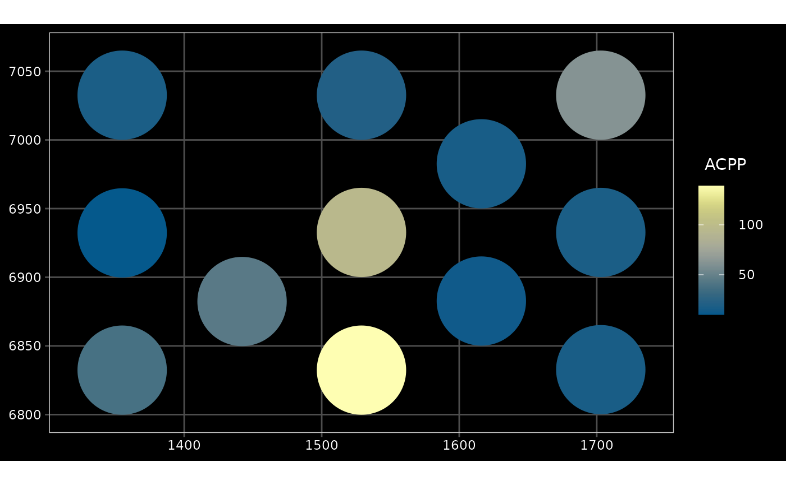

## Load Visium Seurat object (real data)

Visium data is taken from `SeuratData` (ie `stxBrain.SeuratData`),
subsetted to keep first 50 genes, and added to `./inst/extdata/`. Note,
the spot diameter was added manually as `80`, since older Seurat version
had a bug when adding spatial infos to `scale.factors`, `$spot` was too
small and same as `$hires`

Note that as of April 2026,
[`Seurat::SpatialFeaturePlot`](https://satijalab.org/seurat/reference/SpatialPlot.html)
has an error regarding
[`UpdateSeuratObject`](https://github.com/satijalab/seurat/issues/10261).
This problem is resolved in version `5.4.0.9002`, which does not seem to
on CRAN yet as of writing. Use `pak::pak("satijalab/seurat")` to install
this version.

``` r

obj_vis2 <- SeuratTestData("Visium") |> UpdateSeuratObject()
```

    ## see ?SFEData and browseVignettes('SFEData') for documentation

    ## downloading 1 resources

    ## retrieving 1 resource

    ## loading from cache

    ## Warning: Not validating Assay objects
    ## Not validating Assay objects

    ## Warning: Not validating Seurat objects

    ## Validating object structure

    ## Updating object slots

    ## Ensuring keys are in the proper structure
    ## Ensuring keys are in the proper structure

    ## Ensuring feature names don't have underscores or pipes

    ## Updating slots in Spatial

    ## Updating slots in anterior1

    ## Validating object structure for Assay 'Spatial'

    ## Validating object structure for VisiumV1 'anterior1'

    ## Object representation is consistent with the most current Seurat version

``` r

obj_vis2
```

    ## An object of class Seurat 
    ## 50 features across 2696 samples within 1 assay 
    ## Active assay: Spatial (50 features, 0 variable features)
    ##  2 layers present: counts, data
    ##  1 image present: anterior1

``` r

# plot it
SpatialFeaturePlot(obj_vis2, features = rownames(obj_vis2)[1])
```

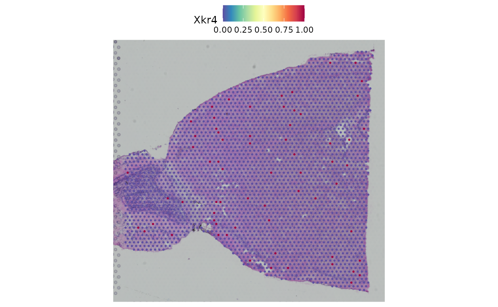 \##
Convert Seurat -\> SFE - Visium (real data)

``` r

# real Visium data
sfe_conv_vis2 <-
  toSpatialFeatureExperiment(x = obj_vis2, 
                             image_scalefactors = "lowres",
                             unit = "micron",
                             BPPARAM = BPPARAM)
```

    ## >>> Seurat Assays found: Spatial
    ## >>> Spatial -> will be used as 'Main Experiment'

    ## >>> Seurat spatial object found: VisiumV1
    ## >>> 'full_res_image_pixel' units will be used ->
    ## ie 'imagerow' & 'imagecol' without scaling factors
    ## >>> set `unit = 'micron'` to convert spot coordinates to micron space

    ## >>> Generating `sf` geometries

    ## Warning: Layer 'scale.data' is empty

    ## 
    ## >>> Creating `SFE` object -> anterior1

    ## >>> Converting pixels to microns

``` r

sfe_conv_vis2
```

    ## class: SpatialFeatureExperiment 
    ## dim: 50 2696 
    ## metadata(0):
    ## assays(2): counts logcounts
    ## rownames(50): Xkr4 Gm1992 ... Ncoa2 Gm29570
    ## rowData names(0):
    ## colnames(2696): AAACAAGTATCTCCCA-1 AAACACCAATAACTGC-1 ...
    ##   TTGTTTCACATCCAGG-1 TTGTTTCCATACAACT-1
    ## colData names(9): orig.ident nCount_Spatial ... in_tissue sample_id
    ## reducedDimNames(0):
    ## mainExpName: Spatial
    ## altExpNames(0):
    ## spatialCoords names(2) : X Y
    ## imgData names(0):
    ## 
    ## unit: micron
    ## Geometries:
    ## colGeometries: spotPoly (POLYGON) 
    ## 
    ## Graphs:
    ## anterior1:

``` r

getMeta(sfe_conv_vis2) %>% str
```

    ## 'data.frame':    2696 obs. of  9 variables:
    ##  $ orig.ident      : Factor w/ 1 level "anterior1": 1 1 1 1 1 1 1 1 1 1 ...
    ##  $ nCount_Spatial  : num  17 35 34 44 35 11 48 49 13 64 ...
    ##  $ nFeature_Spatial: int  9 16 11 14 17 9 16 19 9 15 ...
    ##  $ slice           : num  1 1 1 1 1 1 1 1 1 1 ...
    ##  $ region          : chr  "anterior" "anterior" "anterior" "anterior" ...
    ##  $ array_row       : int  50 59 14 43 47 62 61 42 52 65 ...
    ##  $ array_col       : int  102 19 94 9 13 0 97 28 42 83 ...
    ##  $ in_tissue       : logi  TRUE TRUE TRUE TRUE TRUE TRUE ...
    ##  $ sample_id       : chr  "anterior1" "anterior1" "anterior1" "anterior1" ...

## Plot converted Seurat to SFE - Visium

``` r

plotSpatialFeature(sfe_conv_vis2, exprs_values = "counts",
                   features = rownames(sfe_conv_vis2)[1], 
                   #size = 1, colGeometryName = "spotPoly",
                   dark = TRUE,
                   show_axes = TRUE,
                   #sample_id = "",
                   scattermore = FALSE # will plot only centroids!
                  )
```

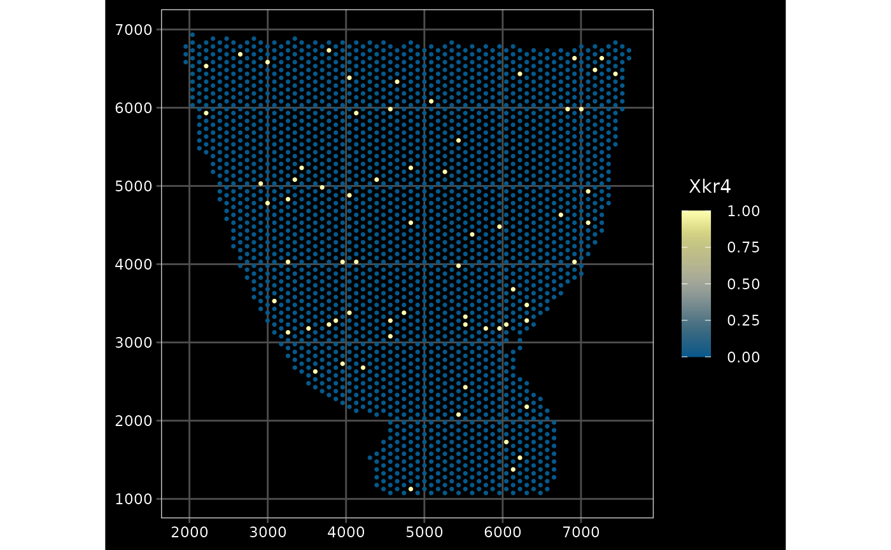

## Convert Seurat -\> SFE - Visium HD

``` r

sfe_vishd <-
  toSpatialFeatureExperiment(x = obj_vishd, 
                             image_scalefactors = "lowres",
                             unit = "micron", #"full_res_image_pixel",
                             BPPARAM = BPPARAM)
```

    ## >>> Seurat Assays found: Spatial.008um
    ## >>> Spatial.008um -> will be used as 'Main Experiment'

    ## >>> Generating `sf` geometries

    ## >>> Seurat spatial object found: VisiumV2 -> VisiumHD

    ## >>> Making POLYGON geometry for bin size: 8 μm with total of 393543 cells, this can take some time!

    ## Warning: Layer 'scale.data' is empty

    ## 
    ## >>> Creating `SFE` object -> slice1.008um

    ## >>> Converting pixels to microns

``` r

sfe_vishd
```

    ## class: SpatialFeatureExperiment 
    ## dim: 50 393543 
    ## metadata(0):
    ## assays(2): counts logcounts
    ## rownames(50): Xkr4 Rp1 ... Gdap1 Pi15
    ## rowData names(0):
    ## colnames(393543): s_008um_00301_00321-1 s_008um_00602_00290-1 ...
    ##   s_008um_00373_00222-1 s_008um_00595_00611-1
    ## colData names(4): orig.ident nCount_Spatial.008um
    ##   nFeature_Spatial.008um sample_id
    ## reducedDimNames(0):
    ## mainExpName: Spatial.008um
    ## altExpNames(0):
    ## spatialCoords names(2) : X Y
    ## imgData names(0):
    ## 
    ## unit: micron
    ## Geometries:
    ## colGeometries: spotPoly (POLYGON) 
    ## 
    ## Graphs:
    ## slice1_008um:

``` r

getMeta(sfe_vishd) %>% str
```

    ## 'data.frame':    393543 obs. of  4 variables:
    ##  $ orig.ident            : chr  "s" "s" "s" "s" ...
    ##  $ nCount_Spatial.008um  : num  0 1 3 3 0 0 1 1 0 2 ...
    ##  $ nFeature_Spatial.008um: int  0 1 3 3 0 0 1 1 0 2 ...
    ##  $ sample_id             : chr  "slice1_008um" "slice1_008um" "slice1_008um" "slice1_008um" ...

## Plot converted Seurat to SFE - Visium HD

``` r

plotSpatialFeature(sfe_vishd, exprs_values = "counts",
                   features = rownames(sfe_vishd)[1], 
                   size = 1, colGeometryName = "spotPoly",
                   dark = TRUE,
                   show_axes = TRUE,
                   #sample_id = "",
                   scattermore = TRUE
                  )
```

    ## scattermore and binning only apply to points. Using centroids.


``` r

plotSpatialFeature(sfe_vishd, exprs_values = "counts",
                   features = rownames(sfe_vishd)[1], 
                   size = 0, colGeometryName = "spotPoly",
                   dark = TRUE,
                   show_axes = TRUE,
                   #sample_id = "",
                   scattermore = FALSE
                  )
```

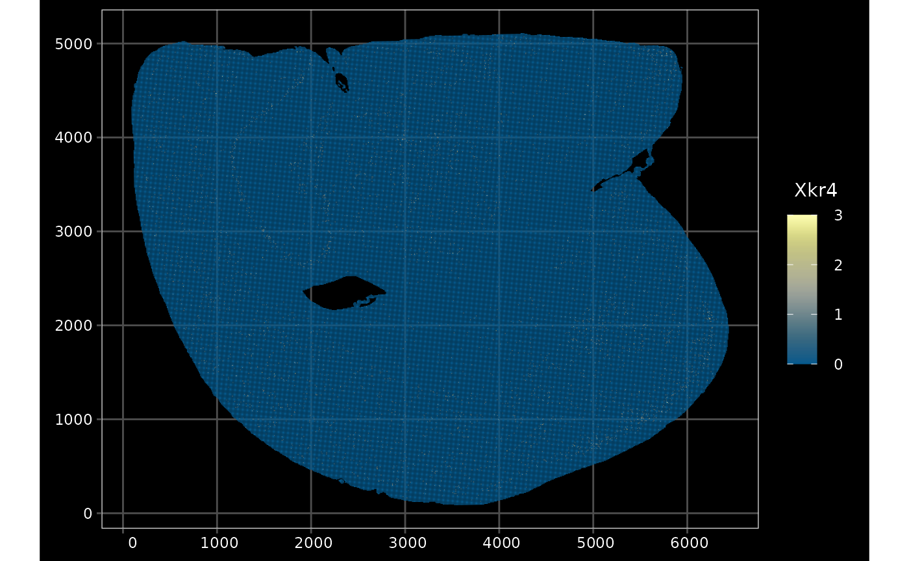

## Convert Seurat -\> SFE - Xenium

``` r

# slim down Xenium obj to keep only 1 Assay
if (!exists("obj_xen_slim"))
  obj_xen_slim <- DietSeurat(obj_xen, assays = "Xenium")
obj_xen_slim <- UpdateSeuratObject(obj_xen_slim)
```

    ## Validating object structure

    ## Updating object slots

    ## Ensuring keys are in the proper structure
    ## Ensuring keys are in the proper structure

    ## Ensuring feature names don't have underscores or pipes

    ## Updating slots in Xenium

    ## Updating slots in xen.toy.1

    ## Validating object structure for Assay 'Xenium'

    ## Validating object structure for FOV 'xen.toy.1'

    ## Object representation is consistent with the most current Seurat version

``` r

#real data subset
sfe_conv_xen <-
  toSpatialFeatureExperiment(x = obj_xen_slim,
                             add_molecules = FALSE,
                             flip = "geometry",
                             #unit = "micron",
                             BPPARAM = BPPARAM
                             )
```

    ## >>> Seurat Assays found: Xenium
    ## >>> Xenium -> will be used as 'Main Experiment'

    ## >>> Seurat spatial FOVs found: 
    ## centroids
    ## segmentation
    ## molecules

    ## >>> Generating `sf` geometries

    ## Warning: Layer 'scale.data' is empty

    ## 
    ## >>> Creating `SFE` object -> xen.toy.1

``` r

sfe_conv_xen
```

    ## class: SpatialFeatureExperiment 
    ## dim: 27 16324 
    ## metadata(0):
    ## assays(2): counts logcounts
    ## rownames(27): AKT1 ALDH1A2 ... SNHG32 SPIB
    ## rowData names(0):
    ## colnames(16324): aaacmono-1 aaaekabk-1 ... ojeogmfc-1 ojfcjbep-1
    ## colData names(10): orig.ident nCount_Xenium ... nFeature_ControlProbe
    ##   sample_id
    ## reducedDimNames(0):
    ## mainExpName: Xenium
    ## altExpNames(0):
    ## spatialCoords names(2) : X Y
    ## imgData names(0):
    ## 
    ## unit: micron
    ## Geometries:
    ## colGeometries: centroids (POINT), cellSeg (POLYGON) 
    ## 
    ## Graphs:
    ## xen_toy_1:

``` r

getMeta(sfe_conv_xen) %>% str
```

    ## 'data.frame':    16324 obs. of  10 variables:
    ##  $ orig.ident              : chr  "xen.toy.1" "xen.toy.1" "xen.toy.1" "xen.toy.1" ...
    ##  $ nCount_Xenium           : num  94 12 174 60 158 44 88 80 15 84 ...
    ##  $ nFeature_Xenium         : int  20 6 20 15 17 14 19 16 9 15 ...
    ##  $ nCount_BlankCodeword    : num  0 0 0 0 0 0 1 0 0 0 ...
    ##  $ nFeature_BlankCodeword  : int  0 0 0 0 0 0 1 0 0 0 ...
    ##  $ nCount_ControlCodeword  : num  0 0 0 0 0 0 0 0 0 0 ...
    ##  $ nFeature_ControlCodeword: int  0 0 0 0 0 0 0 0 0 0 ...
    ##  $ nCount_ControlProbe     : num  0 0 0 0 0 0 0 0 0 0 ...
    ##  $ nFeature_ControlProbe   : int  0 0 0 0 0 0 0 0 0 0 ...
    ##  $ sample_id               : chr  "xen_toy_1" "xen_toy_1" "xen_toy_1" "xen_toy_1" ...

``` r

getMeta(obj_xen) %>% str
```

    ## 'data.frame':    16324 obs. of  9 variables:
    ##  $ orig.ident              : chr  "xen.toy.1" "xen.toy.1" "xen.toy.1" "xen.toy.1" ...
    ##  $ nCount_Xenium           : num  94 12 174 60 158 44 88 80 15 84 ...
    ##  $ nFeature_Xenium         : int  20 6 20 15 17 14 19 16 9 15 ...
    ##  $ nCount_BlankCodeword    : num  0 0 0 0 0 0 1 0 0 0 ...
    ##  $ nFeature_BlankCodeword  : int  0 0 0 0 0 0 1 0 0 0 ...
    ##  $ nCount_ControlCodeword  : num  0 0 0 0 0 0 0 0 0 0 ...
    ##  $ nFeature_ControlCodeword: int  0 0 0 0 0 0 0 0 0 0 ...
    ##  $ nCount_ControlProbe     : num  0 0 0 0 0 0 0 0 0 0 ...
    ##  $ nFeature_ControlProbe   : int  0 0 0 0 0 0 0 0 0 0 ...

``` r

# manual check
ggplot() &
    geom_sf(data = cellSeg(sfe_conv_xen))
```

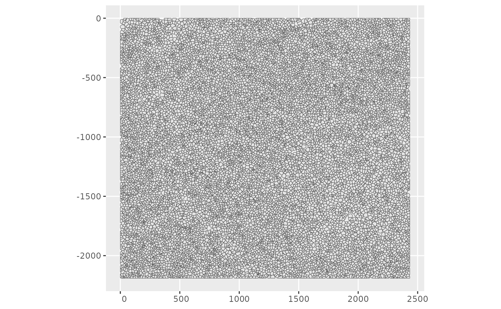

## Plot converted Seurat to SFE - Xenium

``` r

plotSpatialFeature(sfe_conv_xen, exprs_values = "counts",
                   features = rownames(sfe_conv_xen)[1],
                   size = 1, colGeometryName = "centroids", 
                   dark = TRUE,
                   #sample_id = "",
                   scattermore = FALSE # will plot only centroids!
                  )
```

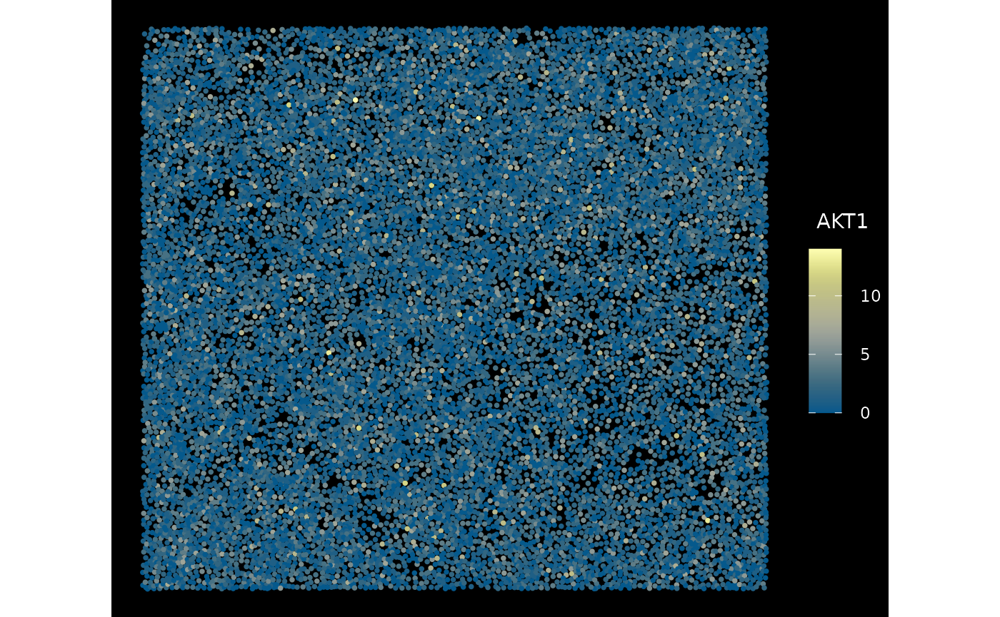

``` r

plotSpatialFeature(sfe_conv_xen, exprs_values = "counts",
                   features = rownames(sfe_conv_xen)[1],
                   size = 1, colGeometryName = "cellSeg", 
                   dark = TRUE,
                   #sample_id = "",
                   scattermore = FALSE # will plot only centroids!
                  )
```


## Convert Seurat -\> SFE - Vizgen

``` r

sfe_conv_vz <-
  toSpatialFeatureExperiment(x = obj_vz,
                             add_molecules = FALSE,
                             flip = "geometry",
                             #unit = "micron",
                             BPPARAM = BPPARAM)
```

    ## >>> Seurat Assays found: Vizgen
    ## >>> Vizgen -> will be used as 'Main Experiment'

    ## >>> Seurat spatial FOVs found: 
    ## centroids
    ## segmentation
    ## molecules

    ## >>> Generating `sf` geometries

    ## Warning: Layer 'scale.data' is empty

    ## 
    ## >>> Creating `SFE` object -> vz.toy.1

``` r

sfe_conv_vz
```

    ## class: SpatialFeatureExperiment 
    ## dim: 49 1046 
    ## metadata(0):
    ## assays(2): counts logcounts
    ## rownames(49): CD4 TLL1 ... SRC HLA-DRB1
    ## rowData names(0):
    ## colnames(1046): 112824700230101253 112824700230101254 ...
    ##   112824700330100920 112824700330100974
    ## colData names(7): orig.ident nCount_Vizgen ... fov sample_id
    ## reducedDimNames(0):
    ## mainExpName: Vizgen
    ## altExpNames(0):
    ## spatialCoords names(2) : X Y
    ## imgData names(0):
    ## 
    ## unit: micron
    ## Geometries:
    ## colGeometries: centroids (POINT), cellSeg (POLYGON) 
    ## 
    ## Graphs:
    ## vz_toy_1:

``` r

getMeta(sfe_conv_vz) %>% str
```

    ## 'data.frame':    1046 obs. of  7 variables:
    ##  $ orig.ident     : chr  "vz.toy.1" "vz.toy.1" "vz.toy.1" "vz.toy.1" ...
    ##  $ nCount_Vizgen  : num  60 127 107 55 165 14 38 74 33 42 ...
    ##  $ nFeature_Vizgen: int  19 25 26 19 24 8 16 14 13 14 ...
    ##  $ z              : int  3 3 3 3 3 3 3 3 3 3 ...
    ##  $ volume         : num  839 803 527 461 584 ...
    ##  $ fov            : logi  NA NA NA NA NA NA ...
    ##  $ sample_id      : chr  "vz_toy_1" "vz_toy_1" "vz_toy_1" "vz_toy_1" ...

``` r

getMeta(obj_vz) %>% str
```

    ## 'data.frame':    1058 obs. of  6 variables:
    ##  $ orig.ident     : chr  "vz.toy.1" "vz.toy.1" "vz.toy.1" "vz.toy.1" ...
    ##  $ nCount_Vizgen  : num  69 57 60 127 107 55 165 14 38 74 ...
    ##  $ nFeature_Vizgen: int  20 19 19 25 26 19 24 8 16 14 ...
    ##  $ z              : int  3 3 3 3 3 3 3 3 3 3 ...
    ##  $ volume         : num  654 487 839 803 527 ...
    ##  $ fov            : logi  NA NA NA NA NA NA ...

``` r

# manual check
ggplot() & 
    geom_sf(data = cellSeg(sfe_conv_vz))
```

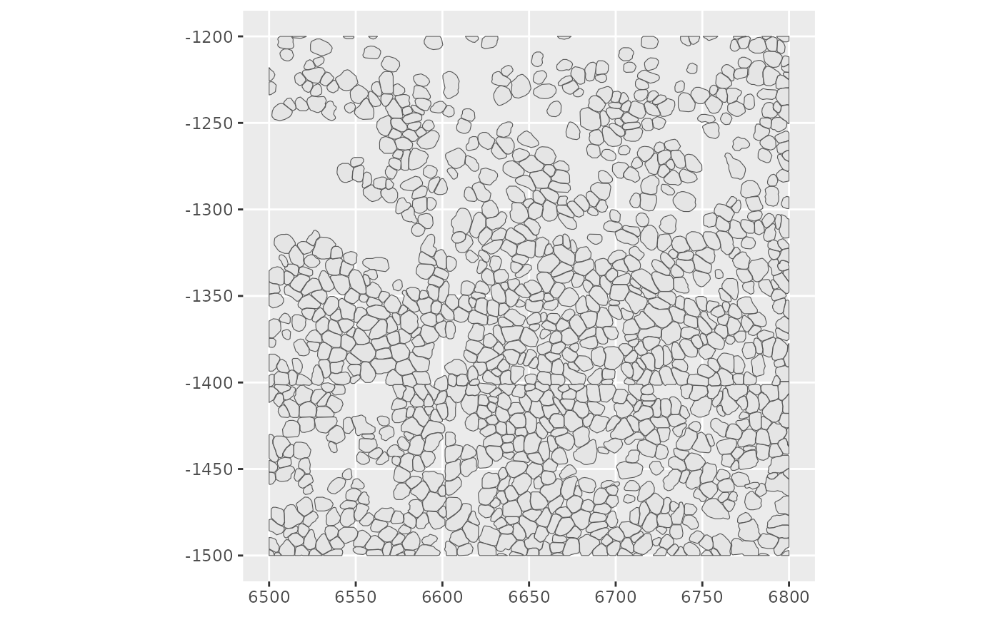

## Plot converted Seurat to SFE - Vizgen

``` r

#options(repr.plot.height = 5, repr.plot.width = 10)
plotSpatialFeature(sfe_conv_vz, exprs_values = "counts",
                   features = rownames(sfe_conv_vz)[1],
                   size = 4, colGeometryName = "cellSeg", 
                   dark = TRUE, #show_axes = T,
                   #sample_id = "",
                   scattermore = FALSE
                  )
```

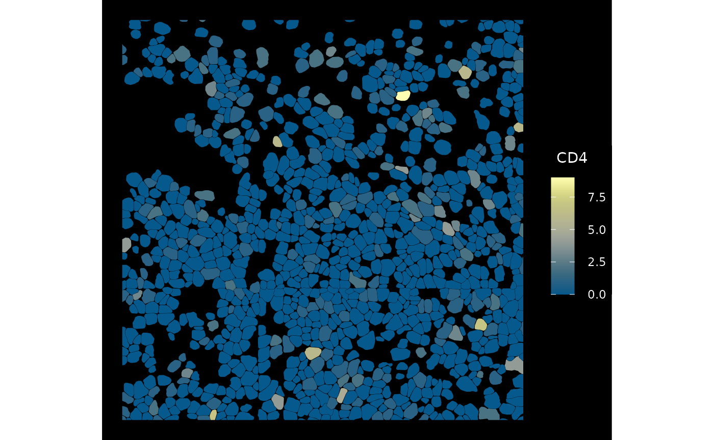

## Test when Seurat object has \> 1 Assay - Xenium

``` r

sfe_conv_xen2 <-
  toSpatialFeatureExperiment(x = obj_xen,
                             add_molecules = FALSE,
                             flip = "geometry",
                             unit = "micron",
                             BPPARAM = BPPARAM
                             )
```

    ## >>> Seurat Assays found: Xenium, BlankCodeword, ControlCodeword, ControlProbe
    ## >>> Xenium -> will be used as 'Main Experiment'

    ## >>> Seurat spatial FOVs found: 
    ## centroids
    ## segmentation
    ## molecules

    ## >>> Generating `sf` geometries

    ## Warning: Layer 'scale.data' is empty

    ## 
    ## >>> Creating `SFE` object -> xen.toy.1

    ## >>> Adding Seurat Assay(s) as Alternative Experiment(s): 
    ## BlankCodeword
    ## ControlCodeword
    ## ControlProbe

    ## Warning: Layer 'scale.data' is empty
    ## Layer 'scale.data' is empty
    ## Layer 'scale.data' is empty

``` r

sfe_conv_xen2
```

    ## class: SpatialFeatureExperiment 
    ## dim: 27 16324 
    ## metadata(0):
    ## assays(2): counts logcounts
    ## rownames(27): AKT1 ALDH1A2 ... SNHG32 SPIB
    ## rowData names(0):
    ## colnames(16324): aaacmono-1 aaaekabk-1 ... ojeogmfc-1 ojfcjbep-1
    ## colData names(10): orig.ident nCount_Xenium ... nFeature_ControlProbe
    ##   sample_id
    ## reducedDimNames(0):
    ## mainExpName: Xenium
    ## altExpNames(3): BlankCodeword ControlCodeword ControlProbe
    ## spatialCoords names(2) : X Y
    ## imgData names(0):
    ## 
    ## unit: micron
    ## Geometries:
    ## colGeometries: centroids (POINT), cellSeg (POLYGON) 
    ## 
    ## Graphs:
    ## xen_toy_1:

``` r

getMeta(sfe_conv_xen2) %>% str
```

    ## 'data.frame':    16324 obs. of  10 variables:
    ##  $ orig.ident              : chr  "xen.toy.1" "xen.toy.1" "xen.toy.1" "xen.toy.1" ...
    ##  $ nCount_Xenium           : num  94 12 174 60 158 44 88 80 15 84 ...
    ##  $ nFeature_Xenium         : int  20 6 20 15 17 14 19 16 9 15 ...
    ##  $ nCount_BlankCodeword    : num  0 0 0 0 0 0 1 0 0 0 ...
    ##  $ nFeature_BlankCodeword  : int  0 0 0 0 0 0 1 0 0 0 ...
    ##  $ nCount_ControlCodeword  : num  0 0 0 0 0 0 0 0 0 0 ...
    ##  $ nFeature_ControlCodeword: int  0 0 0 0 0 0 0 0 0 0 ...
    ##  $ nCount_ControlProbe     : num  0 0 0 0 0 0 0 0 0 0 ...
    ##  $ nFeature_ControlProbe   : int  0 0 0 0 0 0 0 0 0 0 ...
    ##  $ sample_id               : chr  "xen_toy_1" "xen_toy_1" "xen_toy_1" "xen_toy_1" ...

``` r

getMeta(obj_xen) %>% str
```

    ## 'data.frame':    16324 obs. of  9 variables:
    ##  $ orig.ident              : chr  "xen.toy.1" "xen.toy.1" "xen.toy.1" "xen.toy.1" ...
    ##  $ nCount_Xenium           : num  94 12 174 60 158 44 88 80 15 84 ...
    ##  $ nFeature_Xenium         : int  20 6 20 15 17 14 19 16 9 15 ...
    ##  $ nCount_BlankCodeword    : num  0 0 0 0 0 0 1 0 0 0 ...
    ##  $ nFeature_BlankCodeword  : int  0 0 0 0 0 0 1 0 0 0 ...
    ##  $ nCount_ControlCodeword  : num  0 0 0 0 0 0 0 0 0 0 ...
    ##  $ nFeature_ControlCodeword: int  0 0 0 0 0 0 0 0 0 0 ...
    ##  $ nCount_ControlProbe     : num  0 0 0 0 0 0 0 0 0 0 ...
    ##  $ nFeature_ControlProbe   : int  0 0 0 0 0 0 0 0 0 0 ...

## Plot converted Seurat to SFE with several `altExp` - Xenium

``` r

plotSpatialFeature(sfe_conv_xen2, exprs_values = "counts",
                   features = rownames(sfe_conv_xen2)[1],
                   size = 1, colGeometryName = "cellSeg", 
                   dark = TRUE,
                   #sample_id = "",
                   scattermore = FALSE
                  )
```

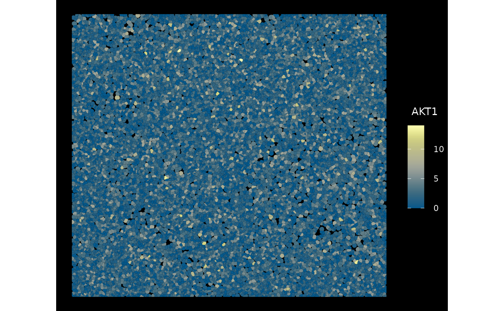

## Plot one of the `altExp` - Xenium

``` r

plotSpatialFeature(altExp(sfe_conv_xen2, 1), exprs_values = "counts",
                   features = rownames(altExp(sfe_conv_xen2, 1))[1],
                   size = 1, colGeometryName = "centroids", 
                   dark = TRUE,
                   #sample_id = "",
                   scattermore = FALSE # will plot only centroids!
)
```

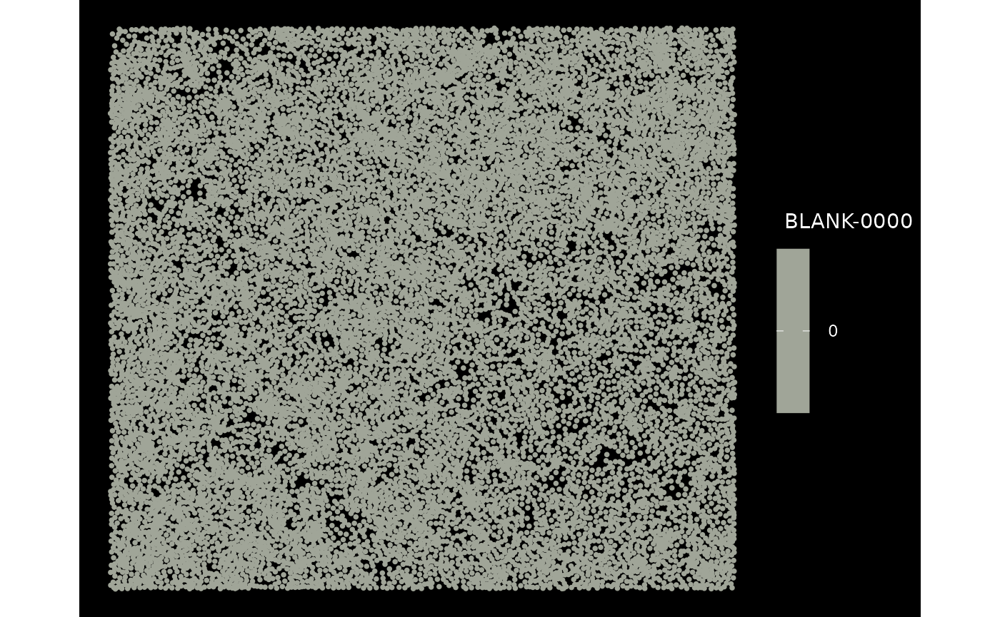

## Test when Seurat object has \> 1 Assay - Vizgen

eg including SCT Assays, as well as PCA, UMAP embedding etc..

``` r

# normalize data
obj_vz %<>% 
    SCTransform(assay = DefaultAssay(obj_vz), verbose = F) %>%
    RunPCA(npcs = 5, verbose = F) %>% 
    RunUMAP(dims = 1:5, verbose = F)
```

    ## `vst.flavor` is set to 'v2' but could not find glmGamPoi installed.
    ## Please install the glmGamPoi package for much faster estimation.
    ## --------------------------------------------
    ## install.packages('BiocManager')
    ## BiocManager::install('glmGamPoi')
    ## --------------------------------------------
    ## Falling back to native (slower) implementation.

    ## Warning: The default method for RunUMAP has changed from calling Python UMAP via reticulate to the R-native UWOT using the cosine metric
    ## To use Python UMAP via reticulate, set umap.method to 'umap-learn' and metric to 'correlation'
    ## This message will be shown once per session

``` r

obj_vz
```

    ## An object of class Seurat 
    ## 98 features across 1058 samples within 2 assays 
    ## Active assay: SCT (49 features, 49 variable features)
    ##  3 layers present: counts, data, scale.data
    ##  1 other assay present: Vizgen
    ##  2 dimensional reductions calculated: pca, umap
    ##  1 spatial field of view present: vz.toy.1

``` r

sfe_conv_vz2 <-
  toSpatialFeatureExperiment(x = obj_vz,
                             add_molecules = FALSE,
                             flip = "geometry",
                             unit = "micron",
                             BPPARAM = BPPARAM
                             )
```

    ## >>> Seurat Assays found: Vizgen, SCT
    ## >>> SCT -> will be used as 'Main Experiment'

    ## >>> Seurat spatial FOVs found: 
    ## centroids
    ## segmentation
    ## molecules

    ## >>> Generating `sf` geometries

    ## 
    ## >>> Creating `SFE` object -> vz.toy.1

    ## >>> Adding Dimensionality Reduction: pca, umap

    ## >>> Adding Seurat Assay(s) as Alternative Experiment(s): 
    ## Vizgen

    ## Warning: Layer 'scale.data' is empty

``` r

sfe_conv_vz2
```

    ## class: SpatialFeatureExperiment 
    ## dim: 49 1046 
    ## metadata(0):
    ## assays(3): counts logcounts scaledata
    ## rownames(49): CD4 TLL1 ... SRC HLA-DRB1
    ## rowData names(0):
    ## colnames(1046): 112824700230101253 112824700230101254 ...
    ##   112824700330100920 112824700330100974
    ## colData names(9): orig.ident nCount_Vizgen ... nFeature_SCT sample_id
    ## reducedDimNames(2): PCA UMAP
    ## mainExpName: SCT
    ## altExpNames(1): Vizgen
    ## spatialCoords names(2) : X Y
    ## imgData names(0):
    ## 
    ## unit: micron
    ## Geometries:
    ## colGeometries: centroids (POINT), cellSeg (POLYGON) 
    ## 
    ## Graphs:
    ## vz_toy_1:

``` r

getMeta(sfe_conv_vz2) %>% str
```

    ## 'data.frame':    1046 obs. of  9 variables:
    ##  $ orig.ident     : chr  "vz.toy.1" "vz.toy.1" "vz.toy.1" "vz.toy.1" ...
    ##  $ nCount_Vizgen  : num  60 127 107 55 165 14 38 74 33 42 ...
    ##  $ nFeature_Vizgen: int  19 25 26 19 24 8 16 14 13 14 ...
    ##  $ z              : int  3 3 3 3 3 3 3 3 3 3 ...
    ##  $ volume         : num  839 803 527 461 584 ...
    ##  $ fov            : logi  NA NA NA NA NA NA ...
    ##  $ nCount_SCT     : num  60 60 63 57 61 52 55 62 55 56 ...
    ##  $ nFeature_SCT   : int  19 18 24 19 13 13 16 14 13 14 ...
    ##  $ sample_id      : chr  "vz_toy_1" "vz_toy_1" "vz_toy_1" "vz_toy_1" ...

### Check `reducedDim`

``` r

ElbowPlot(sfe_conv_vz2, ndims = 5)
```

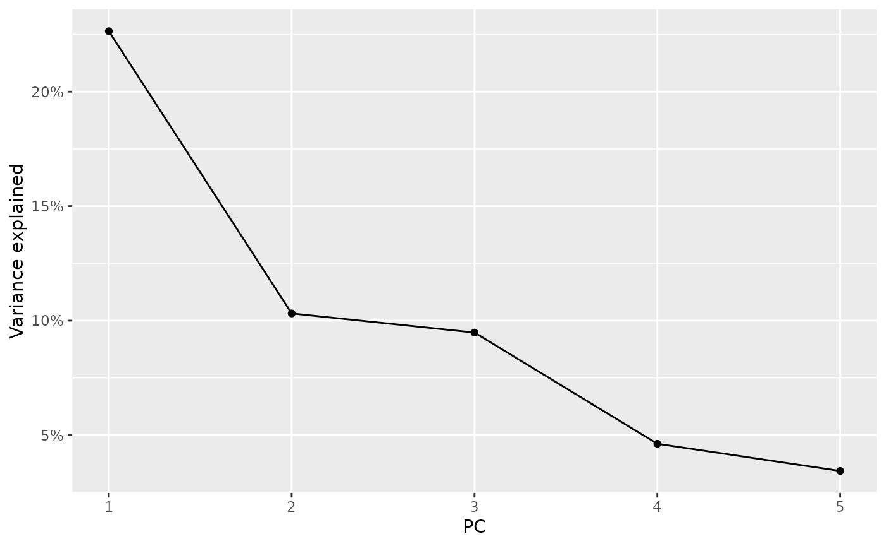

``` r

plotDimLoadings(sfe_conv_vz2, dims = 1:5, nfeatures = 5, reduction = "PCA")
```

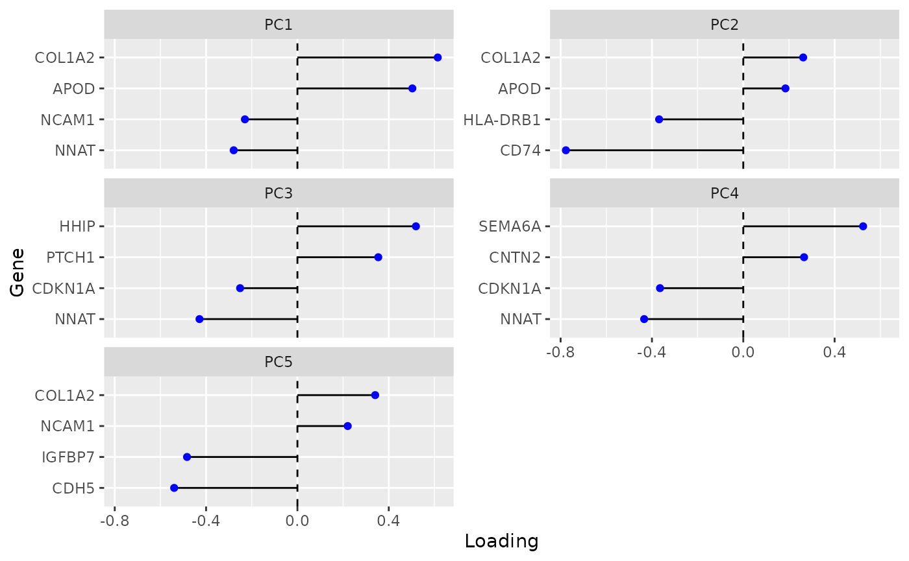

## Load Seurat objects with several samples/FOVs

``` r

obj_vz_multi <- SeuratTestData("VizgenMulti") # Vizgen
```

    ## see ?SFEData and browseVignettes('SFEData') for documentation

    ## downloading 1 resources

    ## retrieving 1 resource

    ## loading from cache

``` r

obj_vz_multi
```

    ## An object of class Seurat 
    ## 49 features across 1058 samples within 1 assay 
    ## Active assay: Vizgen (49 features, 0 variable features)
    ##  2 layers present: counts, data
    ##  2 spatial fields of view present: vz.toy.1 vz.toy.2

``` r

obj_xen_multi <- SeuratTestData("XeniumMulti") # Xenium
```

    ## see ?SFEData and browseVignettes('SFEData') for documentation

    ## downloading 1 resources

    ## retrieving 1 resource

    ## loading from cache

``` r

obj_xen_multi
```

    ## An object of class Seurat 
    ## 541 features across 16324 samples within 4 assays 
    ## Active assay: Xenium (27 features, 0 variable features)
    ##  2 layers present: counts, data
    ##  3 other assays present: BlankCodeword, ControlCodeword, ControlProbe
    ##  2 spatial fields of view present: xen.toy.1 xen.toy.2

``` r

obj_vis_multi <- readRDS(file.path(dir_extdata, "seu_vis_toy_multi.rds")) # Visium
obj_vis_multi
```

    ## An object of class Seurat 
    ## 5 features across 25 samples within 1 assay 
    ## Active assay: RNA (5 features, 0 variable features)
    ##  2 layers present: counts.1, counts.2
    ##  2 images present: sample01, sample02

``` r

obj_vishd_multi <- SeuratTestData("VisiumHDmulti") # Visium HD
```

    ## see ?SFEData and browseVignettes('SFEData') for documentation

    ## downloading 1 resources

    ## retrieving 1 resource

    ## loading from cache

``` r

obj_vishd_multi
```

    ## An object of class Seurat 
    ## 100 features across 492460 samples within 2 assays 
    ## Active assay: Spatial.008um (50 features, 0 variable features)
    ##  2 layers present: counts, data
    ##  1 other assay present: Spatial.016um
    ##  2 spatial fields of view present: slice1.008um slice1.016um

## Convert multiple samples/FOVs - Visium

NOTE, the function will automatically check how many FOVs Seurat object
has and combine those samples in a single SFE object

``` r

# toy Visium data
sfe_vis_multi <-
  toSpatialFeatureExperiment(x = obj_vis_multi, 
                             image_scalefactors = "lowres",
                             unit = "micron",
                             BPPARAM = BPPARAM)
```

    ## >>> 2 spatial FOVs are found, each will be used as `sample_id`: 
    ## sample01
    ## sample02

    ## >>> Seurat Assays found: RNA
    ## >>> RNA -> will be used as 'Main Experiment'

    ## >>> Seurat spatial object found: VisiumV1
    ## >>> 'full_res_image_pixel' units will be used ->
    ## ie 'imagerow' & 'imagecol' without scaling factors
    ## >>> set `unit = 'micron'` to convert spot coordinates to micron space

    ## >>> Generating `sf` geometries

    ## Warning: Layer 'data' is empty

    ## Warning: Layer 'scale.data' is empty

    ## 
    ## >>> Creating `SFE` object -> sample01

    ## >>> Converting pixels to microns

    ## >>> Seurat Assays found: RNA
    ## >>> RNA -> will be used as 'Main Experiment'

    ## >>> Seurat spatial object found: VisiumV1
    ## >>> 'full_res_image_pixel' units will be used ->
    ## ie 'imagerow' & 'imagecol' without scaling factors
    ## >>> set `unit = 'micron'` to convert spot coordinates to micron space

    ## >>> Generating `sf` geometries

    ## Warning: Layer 'data' is empty
    ## Layer 'scale.data' is empty

    ## 
    ## >>> Creating `SFE` object -> sample02

    ## >>> Converting pixels to microns

    ## >>> Combining 2 SFE object(s) with unique `sample_id`

``` r

sfe_vis_multi
```

    ## class: SpatialFeatureExperiment 
    ## dim: 5 25 
    ## metadata(0):
    ## assays(1): counts
    ## rownames(5): ACPP KLK3 MSMB TGM4 TAGLN
    ## rowData names(0):
    ## colnames(25): GTGGCGTGCACCAGAG-1 GGTCCCATAACATAGA-1 ...
    ##   TGCAATTTGGGCACGG-1 ATGCCAATCGCTCTGC-1
    ## colData names(7): orig.ident nCount_RNA ... in_tissue sample_id
    ## reducedDimNames(0):
    ## mainExpName: RNA
    ## altExpNames(0):
    ## spatialCoords names(2) : X Y
    ## imgData names(1): sample_id
    ## 
    ## unit: micron
    ## Geometries:
    ## colGeometries: spotPoly (POLYGON) 
    ## 
    ## Graphs:
    ## sample01: 
    ## sample02:

``` r

getMeta(sfe_vis_multi) %>% str
```

    ## 'data.frame':    25 obs. of  7 variables:
    ##  $ orig.ident  : chr  "SeuratProject" "SeuratProject" "SeuratProject" "SeuratProject" ...
    ##  $ nCount_RNA  : num  165 118 122 709 375 521 167 148 73 137 ...
    ##  $ nFeature_RNA: int  5 5 5 5 5 5 5 5 5 5 ...
    ##  $ array_row   : int  1 1 1 3 2 3 3 5 4 5 ...
    ##  $ array_col   : int  101 103 105 101 102 103 105 101 102 103 ...
    ##  $ in_tissue   : logi  TRUE TRUE TRUE TRUE TRUE TRUE ...
    ##  $ sample_id   : chr  "sample01" "sample01" "sample01" "sample01" ...

## Plot several samples - Visium

``` r

plotSpatialFeature(sfe_vis_multi, exprs_values = "counts",
                   features = rownames(sfe_vis_multi)[1], 
                   #size = 1, colGeometryName = "spotPoly",
                   dark = TRUE,
                   show_axes = TRUE,
                   #sample_id = "",
                   scattermore = FALSE
                  )
```

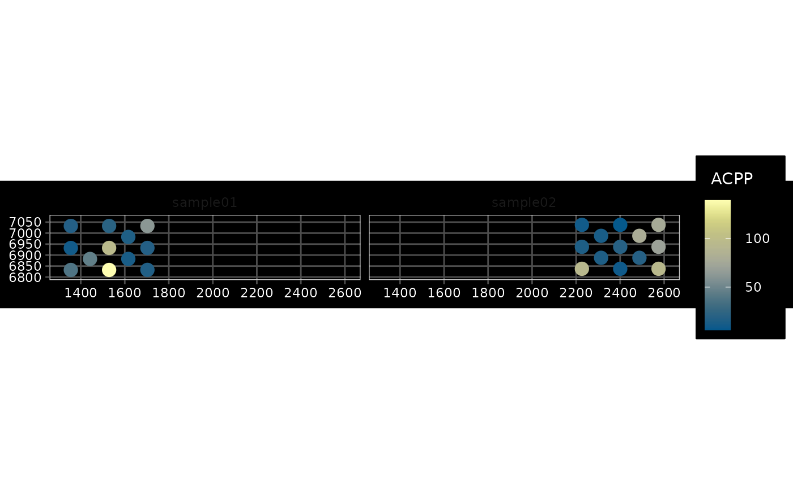

## TODO: Convert multiple samples/FOVs - Visium HD

``` r

sfe_vishd_multi <-
  toSpatialFeatureExperiment(x = obj_vishd_multi, 
                             image_scalefactors = "lowres",
                             unit = "micron",
                             BPPARAM = BPPARAM)
```

    ## >>> 2 spatial FOVs are found, each will be used as `sample_id`: 
    ## slice1.008um
    ## slice1.016um

    ## >>> Seurat Assays found: Spatial.008um, Spatial.016um
    ## >>> Spatial.008um -> will be used as 'Main Experiment'

    ## >>> Generating `sf` geometries

    ## >>> Seurat spatial object found: VisiumV2 -> VisiumHD

    ## >>> Making POLYGON geometry for bin size: 8 μm with total of 393543 cells, this can take some time!

    ## Warning: Layer 'scale.data' is empty

    ## 
    ## >>> Creating `SFE` object -> slice1.008um

    ## >>> Converting pixels to microns

    ## >>> Seurat Assays found: Spatial.008um, Spatial.016um
    ## >>> Spatial.016um -> will be used as 'Main Experiment'

    ## >>> Generating `sf` geometries

    ## >>> Seurat spatial object found: VisiumV2 -> VisiumHD

    ## >>> Making POLYGON geometry for bin size: 16 μm with total of 98917 cells, this can take some time!

    ## Warning: Layer 'data' is empty
    ## Layer 'scale.data' is empty

    ## 
    ## >>> Creating `SFE` object -> slice1.016um

    ## >>> Converting pixels to microns

    ## >>> Combining 2 SFE object(s) with unique `sample_id`

    ## >>> Only following assay(s) are identical and will be kept:
    ## counts

``` r

sfe_vishd_multi
```

    ## class: SpatialFeatureExperiment 
    ## dim: 50 492460 
    ## metadata(0):
    ## assays(1): counts
    ## rownames(50): Xkr4 Rp1 ... Gdap1 Pi15
    ## rowData names(0):
    ## colnames(492460): s_008um_00301_00321-1 s_008um_00602_00290-1 ...
    ##   s_016um_00144_00329-1 s_016um_00176_00108-1
    ## colData names(6): orig.ident nCount_Spatial.008um ...
    ##   nFeature_Spatial.016um sample_id
    ## reducedDimNames(0):
    ## mainExpName: Spatial.008um
    ## altExpNames(0):
    ## spatialCoords names(2) : X Y
    ## imgData names(1): sample_id
    ## 
    ## unit: micron
    ## Geometries:
    ## colGeometries: spotPoly (POLYGON) 
    ## 
    ## Graphs:
    ## slice1_008um: 
    ## slice1_016um:

``` r

getMeta(sfe_vishd_multi) %>% str
```

    ## 'data.frame':    492460 obs. of  6 variables:
    ##  $ orig.ident            : chr  "s" "s" "s" "s" ...
    ##  $ nCount_Spatial.008um  : num  0 1 3 3 0 0 1 1 0 2 ...
    ##  $ nFeature_Spatial.008um: int  0 1 3 3 0 0 1 1 0 2 ...
    ##  $ nCount_Spatial.016um  : num  NA NA NA NA NA NA NA NA NA NA ...
    ##  $ nFeature_Spatial.016um: int  NA NA NA NA NA NA NA NA NA NA ...
    ##  $ sample_id             : chr  "slice1_008um" "slice1_008um" "slice1_008um" "slice1_008um" ...

## Plot several samples - Visium HD

``` r

plotSpatialFeature(sfe_vishd_multi, exprs_values = "counts",
                   features = rownames(sfe_vishd_multi)[1], 
                   #size = 1, colGeometryName = "spotPoly",
                   dark = TRUE,
                   show_axes = TRUE,
                   sample_id = sampleIDs(sfe_vishd_multi)[1],
                   scattermore = TRUE
                  )
```

    ## scattermore and binning only apply to points. Using centroids.

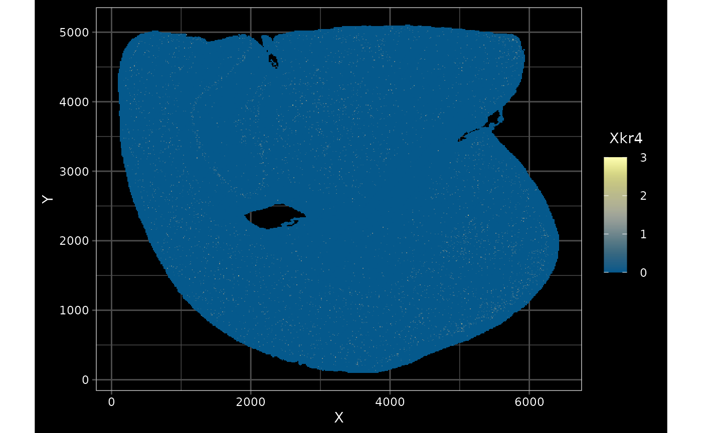

``` r

# 16 microns better plotted using polygons
plotSpatialFeature(sfe_vishd_multi, exprs_values = "counts",
                   features = rownames(sfe_vishd_multi)[1], 
                   size = 0, colGeometryName = "spotPoly",
                   dark = TRUE,
                   show_axes = TRUE,
                   sample_id = sampleIDs(sfe_vishd_multi)[2],
                   scattermore = FALSE
                  )
```

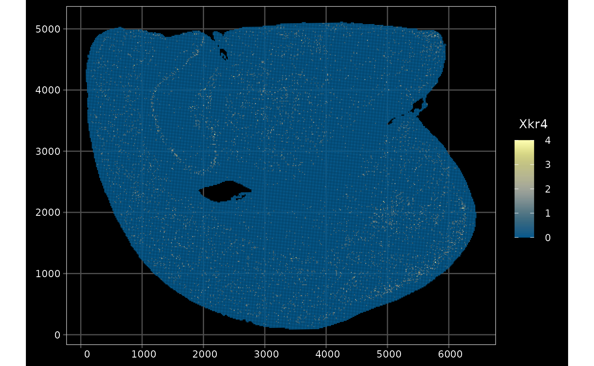

## Convert multiple samples/FOVs - Xenium

``` r

# slim down Xenium obj to keep only 1 Assay
if (!exists("obj_xen_multi.slim"))
  obj_xen_multi.slim <- DietSeurat(obj_xen_multi, assays = "Xenium")
#real data subset
sfe_xen_multi <-
  toSpatialFeatureExperiment(x = obj_xen_multi.slim,
                             add_molecules = FALSE,
                             flip = "geometry",
                             #unit = "micron",
                             BPPARAM = BPPARAM
                             )
```

    ## >>> 2 spatial FOVs are found, each will be used as `sample_id`: 
    ## xen.toy.1
    ## xen.toy.2

    ## >>> Seurat Assays found: Xenium
    ## >>> Xenium -> will be used as 'Main Experiment'

    ## >>> Seurat spatial FOVs found: 
    ## centroids
    ## segmentation
    ## molecules

    ## >>> Generating `sf` geometries

    ## Warning: Layer 'scale.data' is empty

    ## 
    ## >>> Creating `SFE` object -> xen.toy.1

    ## >>> Seurat Assays found: Xenium
    ## >>> Xenium -> will be used as 'Main Experiment'

    ## >>> Seurat spatial FOVs found: 
    ## centroids
    ## segmentation
    ## molecules

    ## >>> Generating `sf` geometries

    ## Warning: Layer 'scale.data' is empty

    ## 
    ## >>> Creating `SFE` object -> xen.toy.2

    ## >>> Combining 2 SFE object(s) with unique `sample_id`

``` r

sfe_xen_multi
```

    ## class: SpatialFeatureExperiment 
    ## dim: 27 16324 
    ## metadata(0):
    ## assays(2): counts logcounts
    ## rownames(27): AKT1 ALDH1A2 ... SNHG32 SPIB
    ## rowData names(0):
    ## colnames(16324): aaacmono-1 aaafcgif-1 ... kfphpbkd-1 npoabajl-1
    ## colData names(10): orig.ident nCount_Xenium ... nFeature_ControlProbe
    ##   sample_id
    ## reducedDimNames(0):
    ## mainExpName: Xenium
    ## altExpNames(0):
    ## spatialCoords names(2) : X Y
    ## imgData names(1): sample_id
    ## 
    ## unit: micron
    ## Geometries:
    ## colGeometries: centroids (POINT), cellSeg (POLYGON) 
    ## 
    ## Graphs:
    ## xen_toy_1: 
    ## xen_toy_2:

``` r

getMeta(sfe_xen_multi) %>% str
```

    ## 'data.frame':    16324 obs. of  10 variables:
    ##  $ orig.ident              : chr  "xen.toy.1" "xen.toy.1" "xen.toy.1" "xen.toy.1" ...
    ##  $ nCount_Xenium           : num  94 174 44 88 15 84 31 48 177 111 ...
    ##  $ nFeature_Xenium         : int  20 20 14 19 9 15 13 13 18 19 ...
    ##  $ nCount_BlankCodeword    : num  0 0 0 1 0 0 0 0 0 0 ...
    ##  $ nFeature_BlankCodeword  : int  0 0 0 1 0 0 0 0 0 0 ...
    ##  $ nCount_ControlCodeword  : num  0 0 0 0 0 0 0 0 0 0 ...
    ##  $ nFeature_ControlCodeword: int  0 0 0 0 0 0 0 0 0 0 ...
    ##  $ nCount_ControlProbe     : num  0 0 0 0 0 0 0 0 0 0 ...
    ##  $ nFeature_ControlProbe   : int  0 0 0 0 0 0 0 0 0 0 ...
    ##  $ sample_id               : chr  "xen_toy_1" "xen_toy_1" "xen_toy_1" "xen_toy_1" ...

## Plot several samples - Xenium

``` r

plotSpatialFeature(sfe_xen_multi, exprs_values = "counts",
                   features = rownames(sfe_xen_multi)[1],
                   size = 1, colGeometryName = "cellSeg", 
                   dark = TRUE,
                   sample_id = sampleIDs(sfe_xen_multi)[1],
                   scattermore = FALSE
                  )
```

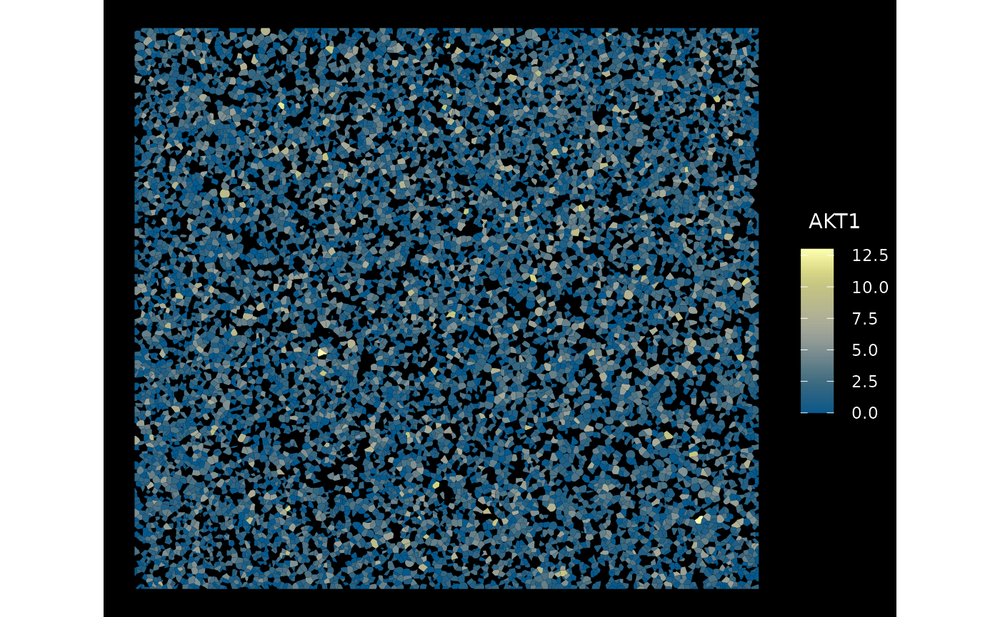

``` r

plotSpatialFeature(sfe_xen_multi, exprs_values = "counts",
                   features = rownames(sfe_xen_multi)[1],
                   size = 1, colGeometryName = "cellSeg", 
                   dark = TRUE,
                   sample_id = sampleIDs(sfe_xen_multi)[2],
                   scattermore = FALSE
                  )
```

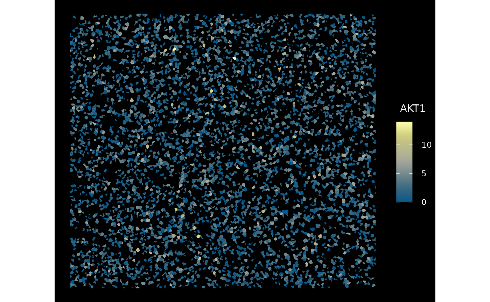

## Convert multiple samples/FOVs - Vizgen

``` r

sfe_vz_multi <-
  toSpatialFeatureExperiment(x = obj_vz_multi,
                             add_molecules = FALSE,
                             flip = "geometry",
                             #unit = "micron",
                             BPPARAM = BPPARAM)
```

    ## >>> 2 spatial FOVs are found, each will be used as `sample_id`: 
    ## vz.toy.1
    ## vz.toy.2

    ## >>> Seurat Assays found: Vizgen
    ## >>> Vizgen -> will be used as 'Main Experiment'

    ## >>> Seurat spatial FOVs found: 
    ## centroids
    ## segmentation
    ## molecules

    ## >>> Generating `sf` geometries

    ## Warning: Layer 'scale.data' is empty

    ## 
    ## >>> Creating `SFE` object -> vz.toy.1

    ## >>> Seurat Assays found: Vizgen
    ## >>> Vizgen -> will be used as 'Main Experiment'

    ## >>> Seurat spatial FOVs found: 
    ## centroids
    ## segmentation
    ## molecules

    ## >>> Generating `sf` geometries

    ## Warning: Layer 'scale.data' is empty

    ## 
    ## >>> Creating `SFE` object -> vz.toy.2

    ## >>> Combining 2 SFE object(s) with unique `sample_id`

``` r

sfe_vz_multi
```

    ## class: SpatialFeatureExperiment 
    ## dim: 49 1046 
    ## metadata(0):
    ## assays(2): counts logcounts
    ## rownames(49): CD4 TLL1 ... SRC HLA-DRB1
    ## rowData names(0):
    ## colnames(1046): 112824700230101253 112824700230101265 ...
    ##   112824700230101970 112824700230101659
    ## colData names(7): orig.ident nCount_Vizgen ... fov sample_id
    ## reducedDimNames(0):
    ## mainExpName: Vizgen
    ## altExpNames(0):
    ## spatialCoords names(2) : X Y
    ## imgData names(1): sample_id
    ## 
    ## unit: micron
    ## Geometries:
    ## colGeometries: centroids (POINT), cellSeg (POLYGON) 
    ## 
    ## Graphs:
    ## vz_toy_1: 
    ## vz_toy_2:

``` r

getMeta(sfe_vz_multi) %>% str
```

    ## 'data.frame':    1046 obs. of  7 variables:
    ##  $ orig.ident     : chr  "vz.toy.1" "vz.toy.1" "vz.toy.1" "vz.toy.1" ...
    ##  $ nCount_Vizgen  : num  60 14 38 42 71 48 6 22 33 75 ...
    ##  $ nFeature_Vizgen: int  19 8 16 14 15 19 5 12 11 19 ...
    ##  $ z              : int  3 3 3 3 3 3 3 3 3 3 ...
    ##  $ volume         : num  839 309 343 403 318 ...
    ##  $ fov            : logi  NA NA NA NA NA NA ...
    ##  $ sample_id      : chr  "vz_toy_1" "vz_toy_1" "vz_toy_1" "vz_toy_1" ...

## Plot several samples - Vizgen

``` r

plotSpatialFeature(sfe_vz_multi, exprs_values = "counts",
                   features = rownames(sfe_vz_multi)[1],
                   size = 4, colGeometryName = "cellSeg", 
                   dark = TRUE, #show_axes = T,
                   #sample_id = "",
                   scattermore = FALSE
                  )
```

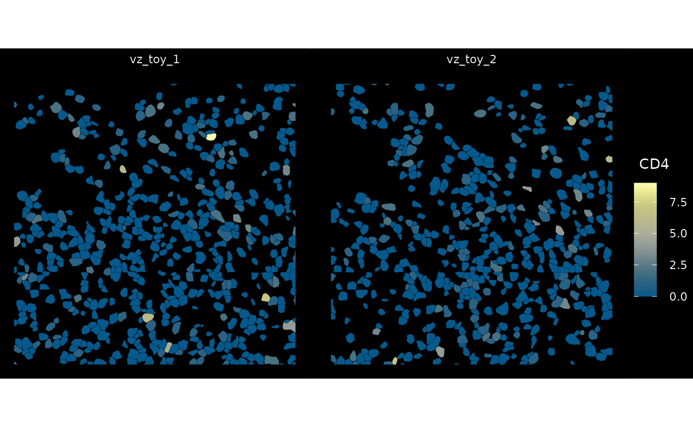

## TODO: Test when multiple samples/FOVs and \> 1 Assays in Seurat object

## TODO: quick analysis using Voyager

``` r

# 
```
