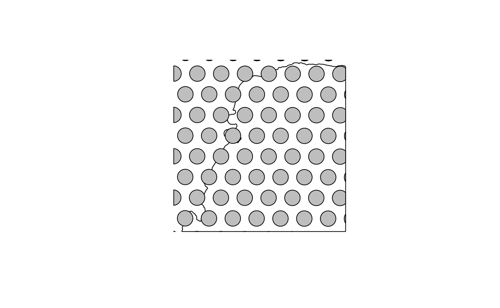
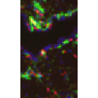
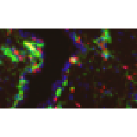
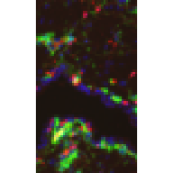
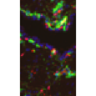
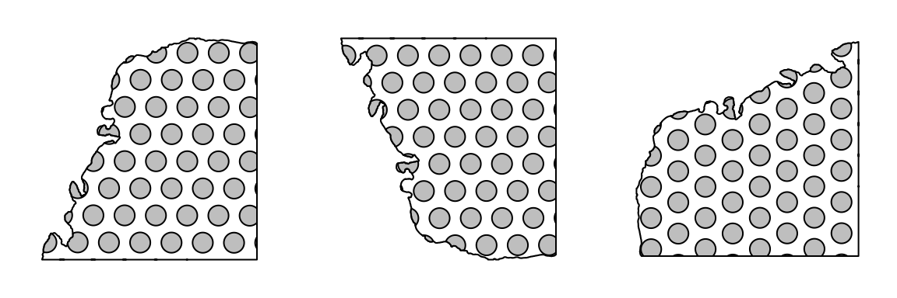

# Introduction to the SpatialFeatureExperiment class

## Installation

This package can be installed from Bioconductor:

``` r
if (!requireNamespace("BiocManager", quietly = TRUE))
  install.packages("BiocManager")
BiocManager::install("SpatialFeatureExperiment")
```

## Class structure

### Introduction

`SpatialFeatureExperiment` (SFE) is a new
[S4](http://adv-r.had.co.nz/S4.md) class built on top of
[`SpatialExperiment`](https://bioconductor.org/packages/release/bioc/html/SpatialExperiment.html)
(SPE). `SpatialFeatureExperiment` incorporates geometries and geometry
operations with the
[`sf`](https://cran.r-project.org/web/packages/sf/index.html) package.
Examples of supported geometries are Visium spots represented with
polygons corresponding to their size, cell or nuclei segmentation
polygons, tissue boundary polygons, pathologist annotation of
histological regions, and transcript spots of genes. Using `sf`,
`SpatialFeatureExperiment` leverages the GEOS C++ libraries underlying
`sf` for geometry operations, including algorithms for for determining
whether geometries intersect, finding intersection geometries, buffering
geometries with margins, etc. A schematic of the SFE object is shown
below:


Schematics of the SFE object

Below is a list of SFE features that extend the SPE object:

- `colGeometries` are `sf` data frames associated with the entities that
  correspond to columns of the gene count matrix, such as Visium spots
  or cells. The geometries in the `sf` data frames can be Visium spot
  centroids, Visium spot polygons, or for datasets with single cell
  resolution, cell or nuclei segmentations. Multiple `colGeometries` can
  be stored in the same SFE object, such as one for cell segmentation
  and another for nuclei segmentation. There can be non-spatial,
  attribute columns in a `colGeometry` rather than `colData`, because
  the `sf` class allows users to specify how attributes relate to
  geometries, such as “constant”, “aggregate”, and “identity”. See the
  `agr` argument of the [`st_sf`
  documentation](https://r-spatial.github.io/sf/reference/sf.html).
- `colGraphs` are spatial neighborhood graphs of cells or spots. The
  graphs have class `listw` (`spdep` package), and the `colPairs` of
  `SingleCellExperiment` was not used so no conversion is necessary to
  use the numerous spatial dependency functions from `spdep`, such as
  those for Moran’s I, Geary’s C, Getis-Ord Gi\*, LOSH, etc. Conversion
  is also not needed for other classical spatial statistics packages
  such as `spatialreg` and `adespatial`.
- `rowGeometries` are similar to `colGeometries`, but support entities
  that correspond to rows of the gene count matrix, such as genes. A
  potential use case is to store transcript spots for each gene in
  smFISH or in situ sequencing based datasets.
- `rowGraphs` are similar to `colGraphs`. A potential use case may be
  spatial colocalization of transcripts of different genes.
- `annotGeometries` are `sf` data frames associated with the dataset but
  not directly with the gene count matrix, such as tissue boundaries,
  histological regions, cell or nuclei segmentation in Visium datasets,
  and etc. These geometries are stored in this object to facilitate
  plotting and using `sf` for operations such as to find the number of
  nuclei in each Visium spot and which histological regions each Visium
  spot intersects. Unlike `colGeometries` and `rowGeometries`, the
  number of rows in the `sf` data frames in `annotGeometries` is not
  constrained by the dimension of the gene count matrix and can be
  arbitrary.
- `annotGraphs` are similar to `colGraphs` and `rowGraphs`, but are for
  entities not directly associated with the gene count matrix, such as
  spatial neighborhood graphs for nuclei in Visium datasets, or other
  objects like myofibers. These graphs are relevant to `spdep` analyses
  of attributes of these geometries such as spatial autocorrelation in
  morphological metrics of myofibers and nuclei. With geometry
  operations with `sf`, these attributes and results of analyses of
  these attributes (e.g. spatial regions defined by the attributes) may
  be related back to gene expression.
- `localResults` are similar to [`reducedDims` in
  `SingleCellExperiment`](https://bioconductor.org/packages/release/bioc/vignettes/SingleCellExperiment/inst/doc/intro.html#3_Adding_low-dimensional_representations),
  but stores results from univariate and bivariate local spatial
  analysis results, such as from
  [`localmoran`](https://r-spatial.github.io/spdep/reference/localmoran.html),
  [Getis-Ord
  Gi\*](https://r-spatial.github.io/spdep/reference/localG.html), and
  [local spatial heteroscedasticity
  (LOSH)](https://r-spatial.github.io/spdep/reference/LOSH.html). Unlike
  in `reducedDims`, for each type of results (type is the type of
  analysis such as Getis-Ord Gi\*), each feature (e.g. gene) or pair of
  features for which the analysis is performed has its own results. The
  local spatial analyses can also be performed for attributes of
  `colGeometries` and `annotGeometries` in addition to gene expression
  and `colData`. Results of multivariate spatial analysis such as
  [MULTISPATI
  PCA](https://cran.r-project.org/web/packages/adespatial/vignettes/tutorial.html#multispati-analysis)
  can be stored in `reducedDims`.

``` r
library(SpatialFeatureExperiment)
#> There appears to be a problem with the PROJ installation
#> 
#> Attaching package: 'SpatialFeatureExperiment'
#> The following object is masked from 'package:base':
#> 
#>     scale
library(SpatialExperiment)
#> Loading required package: SingleCellExperiment
#> Loading required package: SummarizedExperiment
#> Loading required package: MatrixGenerics
#> Loading required package: matrixStats
#> 
#> Attaching package: 'MatrixGenerics'
#> The following objects are masked from 'package:matrixStats':
#> 
#>     colAlls, colAnyNAs, colAnys, colAvgsPerRowSet, colCollapse,
#>     colCounts, colCummaxs, colCummins, colCumprods, colCumsums,
#>     colDiffs, colIQRDiffs, colIQRs, colLogSumExps, colMadDiffs,
#>     colMads, colMaxs, colMeans2, colMedians, colMins, colOrderStats,
#>     colProds, colQuantiles, colRanges, colRanks, colSdDiffs, colSds,
#>     colSums2, colTabulates, colVarDiffs, colVars, colWeightedMads,
#>     colWeightedMeans, colWeightedMedians, colWeightedSds,
#>     colWeightedVars, rowAlls, rowAnyNAs, rowAnys, rowAvgsPerColSet,
#>     rowCollapse, rowCounts, rowCummaxs, rowCummins, rowCumprods,
#>     rowCumsums, rowDiffs, rowIQRDiffs, rowIQRs, rowLogSumExps,
#>     rowMadDiffs, rowMads, rowMaxs, rowMeans2, rowMedians, rowMins,
#>     rowOrderStats, rowProds, rowQuantiles, rowRanges, rowRanks,
#>     rowSdDiffs, rowSds, rowSums2, rowTabulates, rowVarDiffs, rowVars,
#>     rowWeightedMads, rowWeightedMeans, rowWeightedMedians,
#>     rowWeightedSds, rowWeightedVars
#> Loading required package: GenomicRanges
#> Loading required package: stats4
#> Loading required package: BiocGenerics
#> Loading required package: generics
#> 
#> Attaching package: 'generics'
#> The following objects are masked from 'package:base':
#> 
#>     as.difftime, as.factor, as.ordered, intersect, is.element, setdiff,
#>     setequal, union
#> 
#> Attaching package: 'BiocGenerics'
#> The following objects are masked from 'package:stats':
#> 
#>     IQR, mad, sd, var, xtabs
#> The following objects are masked from 'package:base':
#> 
#>     anyDuplicated, aperm, append, as.data.frame, basename, cbind,
#>     colnames, dirname, do.call, duplicated, eval, evalq, Filter, Find,
#>     get, grep, grepl, is.unsorted, lapply, Map, mapply, match, mget,
#>     order, paste, pmax, pmax.int, pmin, pmin.int, Position, rank,
#>     rbind, Reduce, rownames, sapply, saveRDS, table, tapply, unique,
#>     unsplit, which.max, which.min
#> Loading required package: S4Vectors
#> 
#> Attaching package: 'S4Vectors'
#> The following object is masked from 'package:utils':
#> 
#>     findMatches
#> The following objects are masked from 'package:base':
#> 
#>     expand.grid, I, unname
#> Loading required package: IRanges
#> Loading required package: Seqinfo
#> Loading required package: Biobase
#> Welcome to Bioconductor
#> 
#>     Vignettes contain introductory material; view with
#>     'browseVignettes()'. To cite Bioconductor, see
#>     'citation("Biobase")', and for packages 'citation("pkgname")'.
#> 
#> Attaching package: 'Biobase'
#> The following object is masked from 'package:MatrixGenerics':
#> 
#>     rowMedians
#> The following objects are masked from 'package:matrixStats':
#> 
#>     anyMissing, rowMedians
library(SFEData)
library(sf)
#> Linking to GEOS 3.13.0, GDAL 3.8.5, PROJ 9.5.1; sf_use_s2() is TRUE
library(Matrix)
#> 
#> Attaching package: 'Matrix'
#> The following object is masked from 'package:S4Vectors':
#> 
#>     expand
library(RBioFormats)
#> BioFormats library version 7.3.0
library(spdep)
#> Loading required package: spData
#> To access larger datasets in this package, install the spDataLarge
#> package with: `install.packages('spDataLarge',
#> repos='https://nowosad.github.io/drat/', type='source')`
library(VisiumIO)
#> Loading required package: TENxIO
set.SubgraphOption(FALSE)
```

``` r
# Example dataset
(sfe <- McKellarMuscleData(dataset = "small"))
#> see ?SFEData and browseVignettes('SFEData') for documentation
#> loading from cache
#> class: SpatialFeatureExperiment 
#> dim: 15123 77 
#> metadata(0):
#> assays(1): counts
#> rownames(15123): ENSMUSG00000025902 ENSMUSG00000096126 ...
#>   ENSMUSG00000064368 ENSMUSG00000064370
#> rowData names(6): Ensembl symbol ... vars cv2
#> colnames(77): AAATTACCTATCGATG AACATATCAACTGGTG ... TTCTTTGGTCGCGACG
#>   TTGATGTGTAGTCCCG
#> colData names(12): barcode col ... prop_mito in_tissue
#> reducedDimNames(0):
#> mainExpName: NULL
#> altExpNames(0):
#> spatialCoords names(2) : imageX imageY
#> imgData names(1): sample_id
#> 
#> unit: full_res_image_pixels
#> Geometries:
#> colGeometries: spotPoly (POLYGON) 
#> annotGeometries: tissueBoundary (POLYGON), myofiber_full (GEOMETRY), myofiber_simplified (GEOMETRY), nuclei (POLYGON), nuclei_centroid (POINT) 
#> 
#> Graphs:
#> Vis5A:
```

### Geometries

User interfaces to get or set the geometries and spatial graphs emulate
those of `reducedDims` and `row/colPairs` in `SingleCellExperiment`.
Column and row geometries also emulate `reducedDims` in internal
implementation, while annotation geometries and spatial graphs differ.

#### Column and row

Column and row geometries can be get or set with the
[`dimGeometries()`](https://pachterlab.github.io/SpatialFeatureExperiment/dev/reference/dimGeometries.md)
or
[`dimGeometry()`](https://pachterlab.github.io/SpatialFeatureExperiment/dev/reference/dimGeometries.md)
function. The `MARGIN` argument is as in the
[`apply()`](https://rdrr.io/r/base/apply.html) function: `MARGIN = 1`
means row, and `MARGIN = 2` means column.

[`dimGeometry()`](https://pachterlab.github.io/SpatialFeatureExperiment/dev/reference/dimGeometries.md)
gets or sets one particular geometry by name of index.

``` r
# Get Visium spot polygons
(spots <- dimGeometry(sfe, "spotPoly", MARGIN = 2))
#> Simple feature collection with 77 features and 1 field
#> Geometry type: POLYGON
#> Dimension:     XY
#> Bounding box:  xmin: 5000 ymin: 13000 xmax: 7000 ymax: 15000
#> CRS:           NA
#> First 10 features:
#>                                        geometry sample_id
#> AAATTACCTATCGATG POLYGON ((6472.186 13875.23...     Vis5A
#> AACATATCAACTGGTG POLYGON ((5778.291 13635.43...     Vis5A
#> AAGATTGGCGGAACGT POLYGON ((7000 13809.84, 69...     Vis5A
#> AAGGGACAGATTCTGT POLYGON ((6749.535 13874.64...     Vis5A
#> AATATCGAGGGTTCTC POLYGON ((5500.941 13636.03...     Vis5A
#> AATGATGATACGCTAT POLYGON ((6612.42 14598.82,...     Vis5A
#> AATGATGCGACTCCTG POLYGON ((5501.981 14118.62...     Vis5A
#> AATTCATAAGGGATCT POLYGON ((6889.769 14598.22...     Vis5A
#> ACGAGTACGGATGCCC POLYGON ((5084.397 13395.63...     Vis5A
#> ACGCTAGTGATACACT POLYGON ((5639.096 13394.44...     Vis5A
```

``` r
plot(st_geometry(spots))
```


``` r
# Setter
dimGeometry(sfe, "foobar", MARGIN = 2) <- spots
```

[`dimGeometries()`](https://pachterlab.github.io/SpatialFeatureExperiment/dev/reference/dimGeometries.md)
gets or sets all geometry of the given margin.

``` r
# Getter, all geometries of one margin
(cgs <- dimGeometries(sfe, MARGIN = 2))
#> List of length 2
#> names(2): spotPoly foobar
```

``` r
# Setter, all geometries
dimGeometries(sfe, MARGIN = 2) <- cgs
```

[`dimGeometryNames()`](https://pachterlab.github.io/SpatialFeatureExperiment/dev/reference/dimGeometries.md)
gets or sets the names of the geometries

``` r
(cg_names <- dimGeometryNames(sfe, MARGIN = 2))
#> [1] "spotPoly" "foobar"
```

``` r
# Setter
dimGeometryNames(sfe, MARGIN = 2) <- cg_names
```

`colGeometry(sfe, "spotPoly")`, `colGeometries(sfe)`, and
`colGeometryNames(sfe)` are shorthands for
`dimGeometry(sfe, "spotPoly", MARGIN = 2)`,
`dimGeometries(sfe, MARGIN = 2)`, and
`dimGeometryNames(sfe, MARGIN = 2)` respectively. Similarly,
`rowGeometr*(sfe, ...)` is a shorthand of
`dimGeometr*(sfe, ..., MARGIN = 1)`.

There are shorthands for some specific column or row geometries. For
example, `spotPoly(sfe)` is equivalent to `colGeometry(sfe, "spotPoly")`
for Visium spot polygons, and `txSpots(sfe)` is equivalent to
`rowGeometry(sfe, "txSpots")` for transcript spots in single molecule
technologies.

``` r
# Getter
(spots <- spotPoly(sfe))
#> Simple feature collection with 77 features and 1 field
#> Geometry type: POLYGON
#> Dimension:     XY
#> Bounding box:  xmin: 5000 ymin: 13000 xmax: 7000 ymax: 15000
#> CRS:           NA
#> First 10 features:
#>                                        geometry sample_id
#> AAATTACCTATCGATG POLYGON ((6472.186 13875.23...     Vis5A
#> AACATATCAACTGGTG POLYGON ((5778.291 13635.43...     Vis5A
#> AAGATTGGCGGAACGT POLYGON ((7000 13809.84, 69...     Vis5A
#> AAGGGACAGATTCTGT POLYGON ((6749.535 13874.64...     Vis5A
#> AATATCGAGGGTTCTC POLYGON ((5500.941 13636.03...     Vis5A
#> AATGATGATACGCTAT POLYGON ((6612.42 14598.82,...     Vis5A
#> AATGATGCGACTCCTG POLYGON ((5501.981 14118.62...     Vis5A
#> AATTCATAAGGGATCT POLYGON ((6889.769 14598.22...     Vis5A
#> ACGAGTACGGATGCCC POLYGON ((5084.397 13395.63...     Vis5A
#> ACGCTAGTGATACACT POLYGON ((5639.096 13394.44...     Vis5A
```

``` r
# Setter
spotPoly(sfe) <- spots
```

#### Annotation

Annotation geometries can be get or set with
[`annotGeometries()`](https://pachterlab.github.io/SpatialFeatureExperiment/dev/reference/annotGeometries.md)
or
[`annotGeometry()`](https://pachterlab.github.io/SpatialFeatureExperiment/dev/reference/annotGeometries.md).
In column or row geometries, the number of rows of the `sf` data frame
(i.e. the number of geometries in the data frame) is constrained by the
number of rows or columns of the gene count matrix respectively, because
just like `rowData` and `colData`, each row of a `rowGeometry` or
`colGeometry` `sf` data frame must correspond to a row or column of the
gene count matrix respectively. In contrast, an `annotGeometry` `sf`
data frame can have any dimension, not constrained by the dimension of
the gene count matrix. Similar to column and row geometries, annotation
geometries have
[`annotGeometry()`](https://pachterlab.github.io/SpatialFeatureExperiment/dev/reference/annotGeometries.md),
[`annotGeometries()`](https://pachterlab.github.io/SpatialFeatureExperiment/dev/reference/annotGeometries.md),
and
[`annotGeometryNames()`](https://pachterlab.github.io/SpatialFeatureExperiment/dev/reference/annotGeometries.md)
getters and setters.

``` r
# Getter, by name or index
(tb <- annotGeometry(sfe, "tissueBoundary"))
#> Simple feature collection with 1 feature and 2 fields
#> Geometry type: POLYGON
#> Dimension:     XY
#> Bounding box:  xmin: 5094 ymin: 13000 xmax: 7000 ymax: 14969
#> CRS:           NA
#>   ID                       geometry sample_id
#> 7  7 POLYGON ((5094 13000, 5095 ...     Vis5A
```

``` r
plot(st_geometry(tb))
```


``` r
# Setter, by name or index
annotGeometry(sfe, "tissueBoundary") <- tb
```

``` r
# Get all annoation geometries as named list
ags <- annotGeometries(sfe)
```

``` r
# Set all annotation geometries with a named list
annotGeometries(sfe) <- ags
```

``` r
# Get names of annotation geometries
(ag_names <- annotGeometryNames(sfe))
#> [1] "tissueBoundary"      "myofiber_full"       "myofiber_simplified"
#> [4] "nuclei"              "nuclei_centroid"
```

``` r
# Set names
annotGeometryNames(sfe) <- ag_names
```

There are shorthands for specific annotation geometries. For example,
`tissueBoundary(sfe)` is equivalent to
`annotGeometry(sfe, "tissueBoundary")`.
[`cellSeg()`](https://pachterlab.github.io/SpatialFeatureExperiment/dev/reference/colGeometries.md)
(cell segmentation) and
[`nucSeg()`](https://pachterlab.github.io/SpatialFeatureExperiment/dev/reference/colGeometries.md)
(nuclei segmentation) would first query `colGeometries` (for single
cell, single molecule technologies, equivalent to
`colGeometry(sfe, "cellSeg")` or `colGeometry(sfe, "nucSeg")`), and if
not found, they will query `annotGeometries` (for array capture and
microdissection technologies, equivalent to
`annotGeometry(sfe, "cellSeg")` or `annotGeometry(sfe, "nucSeg")`).

``` r
# Getter
(tb <- tissueBoundary(sfe))
#> Simple feature collection with 1 feature and 2 fields
#> Geometry type: POLYGON
#> Dimension:     XY
#> Bounding box:  xmin: 5094 ymin: 13000 xmax: 7000 ymax: 14969
#> CRS:           NA
#>   ID                       geometry sample_id
#> 7  7 POLYGON ((5094 13000, 5095 ...     Vis5A
```

``` r
# Setter
tissueBoundary(sfe) <- tb
```

### Spatial graphs

Column, row, and annotation spatial graphs can be get or set with
[`spatialGraphs()`](https://pachterlab.github.io/SpatialFeatureExperiment/dev/reference/spatialGraphs.md)
and
[`spatialGraph()`](https://pachterlab.github.io/SpatialFeatureExperiment/dev/reference/spatialGraphs.md)
functions. Similar to `dimGeometr*` functions, `spatialGraph*` functions
have a `MARGIN` argument. However, since internally, row and column
geometries are implemented very differently from annotation geometries,
while row, column, and annotation graphs are implemented the same way,
for the `spatialGraph*` functions, `MARGIN = 1` means rows, `MARGIN = 2`
means columns, and `MARGIN = 3` means annotation. Similar to
`dimGeometry*` functions, there are `rowGraph*`, `colGraph*`, and
`annotGraph*` getter and setter functions for each margin.

This package wraps functions in the `spdep` package to find spatial
neighborhood graphs. In this example, triangulation is used to find the
spatial graph; many other methods are also supported, such as k nearest
neighbors, distance based neighbors, and polygon contiguity.

``` r
(g <- findSpatialNeighbors(sfe, MARGIN = 2, method = "tri2nb"))
#> Characteristics of weights list object:
#> Neighbour list object:
#> Number of regions: 77 
#> Number of nonzero links: 428 
#> Percentage nonzero weights: 7.218755 
#> Average number of links: 5.558442 
#> 
#> Weights style: W 
#> Weights constants summary:
#>    n   nn S0      S1       S2
#> W 77 5929 77 28.0096 309.4083
```

``` r
plot(g, coords = spatialCoords(sfe))
```


``` r
# Set graph by name
spatialGraph(sfe, "graph1", MARGIN = 2) <- g
# Or equivalently
colGraph(sfe, "graph1") <- g
```

``` r
# Get graph by name
g <- spatialGraph(sfe, "graph1", MARGIN = 2L)
# Or equivalently
g <- colGraph(sfe, "graph1")
g
#> Characteristics of weights list object:
#> Neighbour list object:
#> Number of regions: 77 
#> Number of nonzero links: 428 
#> Percentage nonzero weights: 7.218755 
#> Average number of links: 5.558442 
#> 
#> Weights style: W 
#> Weights constants summary:
#>    n   nn S0      S1       S2
#> W 77 5929 77 28.0096 309.4083
```

For Visium, spatial neighborhood graph of the hexagonal grid can be
found with the known locations of the barcodes.

``` r
colGraph(sfe, "visium") <- findVisiumGraph(sfe, zero.policy = TRUE)
```

``` r
plot(colGraph(sfe, "visium"), coords = spatialCoords(sfe))
```


All graphs of the SFE object, or if specified, of the margin of
interest, can be get or set with
[`spatialGraphs()`](https://pachterlab.github.io/SpatialFeatureExperiment/dev/reference/spatialGraphs.md)
and the margin specific wrappers.

``` r
colGraphs(sfe)
#> $col
#> Characteristics of weights list object:
#> Neighbour list object:
#> Number of regions: 77 
#> Number of nonzero links: 428 
#> Percentage nonzero weights: 7.218755 
#> Average number of links: 5.558442 
#> 
#> Weights style: W 
#> Weights constants summary:
#>    n   nn S0      S1       S2
#> W 77 5929 77 28.0096 309.4083
```

Similar to
[`dimGeometries()`](https://pachterlab.github.io/SpatialFeatureExperiment/dev/reference/dimGeometries.md),
the graphs have
[`spatialGraphNames()`](https://pachterlab.github.io/SpatialFeatureExperiment/dev/reference/spatialGraphs.md)
getter and setter and the margin specific wrappers.

``` r
colGraphNames(sfe)
#> [1] "graph1" "visium"
```

### Multiple samples

Thus far, the example dataset used only has one sample. The
`SpatialExperiment` (SPE) object has a special column in `colData`
called `sample_id`, so data from multiple tissue sections can coexist in
the same SPE object for joint dimension reduction and clustering while
keeping the spatial coordinates separate. It’s important to keep spatial
coordinates of different tissue sections separate because first, the
coordinates would only make sense within the same section, and second,
the coordinates from different sections can have overlapping numeric
values.

SFE inherits from SPE, and with geometries and spatial graphs,
`sample_id` is even more important. The geometry and graph getter and
setter functions have a `sample_id` argument, which is optional when
only one sample is present in the SFE object. This argument is mandatory
if multiple samples are present, and can be a character vector for
multiple samples or “all” for all samples. Below are examples of using
the getters and setters for multiple samples.

``` r
# Construct toy dataset with 2 samples
sfe1 <- McKellarMuscleData(dataset = "small")
#> see ?SFEData and browseVignettes('SFEData') for documentation
#> loading from cache
sfe2 <- McKellarMuscleData(dataset = "small2")
#> see ?SFEData and browseVignettes('SFEData') for documentation
#> loading from cache
spotPoly(sfe2)$sample_id <- "sample02"
(sfe_combined <- cbind(sfe1, sfe2))
#> class: SpatialFeatureExperiment 
#> dim: 15123 149 
#> metadata(0):
#> assays(1): counts
#> rownames(15123): ENSMUSG00000025902 ENSMUSG00000096126 ...
#>   ENSMUSG00000064368 ENSMUSG00000064370
#> rowData names(6): Ensembl symbol ... vars cv2
#> colnames(149): AAATTACCTATCGATG AACATATCAACTGGTG ... TTCCTCGGACTAACCA
#>   TTCTGACCGGGCTCAA
#> colData names(12): barcode col ... prop_mito in_tissue
#> reducedDimNames(0):
#> mainExpName: NULL
#> altExpNames(0):
#> spatialCoords names(2) : imageX imageY
#> imgData names(1): sample_id
#> 
#> unit: full_res_image_pixels
#> Geometries:
#> colGeometries: spotPoly (POLYGON) 
#> annotGeometries: tissueBoundary (GEOMETRY), myofiber_full (GEOMETRY), myofiber_simplified (GEOMETRY), nuclei (POLYGON), nuclei_centroid (POINT) 
#> 
#> Graphs:
#> Vis5A: 
#> sample02:
```

Use the `sampleIDs` function to see the names of all samples

``` r
sampleIDs(sfe_combined)
#> [1] "Vis5A"    "sample02"
```

``` r
# Only get the geometries for the second sample
(spots2 <- colGeometry(sfe_combined, "spotPoly", sample_id = "sample02"))
#> Simple feature collection with 72 features and 1 field
#> Geometry type: POLYGON
#> Dimension:     XY
#> Bounding box:  xmin: 6000 ymin: 7025.865 xmax: 8000 ymax: 9000
#> CRS:           NA
#> First 10 features:
#>                  sample_id                       geometry
#> AACACACGCTCGCCGC  sample02 POLYGON ((6597.869 7842.575...
#> AACCGCTAAGGGATGC  sample02 POLYGON ((6724.811 9000, 67...
#> AACGCTGTTGCTGAAA  sample02 POLYGON ((6457.635 7118.991...
#> AACGGACGTACGTATA  sample02 POLYGON ((6737.064 8083.571...
#> AATAGAATCTGTTTCA  sample02 POLYGON ((7570.153 8564.368...
#> ACAAATCGCACCGAAT  sample02 POLYGON ((8000 7997.001, 79...
#> ACAATTGTGTCTCTTT  sample02 POLYGON ((6043.169 7843.77,...
#> ACAGGCTTGCCCGACT  sample02 POLYGON ((7428.88 7358.195,...
#> ACCAGTGCGGGAGACG  sample02 POLYGON ((6460.753 8566.757...
#> ACCCTCCCTTGCTATT  sample02 POLYGON ((7847.503 8563.77,...
```

``` r
# Only set the geometries for the second sample
# Leaving geometries of the first sample intact
colGeometry(sfe_combined, "spotPoly", sample_id = "sample02") <- spots2
```

``` r
# Set graph only for the second sample
colGraph(sfe_combined, "foo", sample_id = "sample02") <- 
  findSpatialNeighbors(sfe_combined, sample_id = "sample02")
```

``` r
# Get graph only for the second sample
colGraph(sfe_combined, "foo", sample_id = "sample02")
#> Characteristics of weights list object:
#> Neighbour list object:
#> Number of regions: 72 
#> Number of nonzero links: 406 
#> Percentage nonzero weights: 7.83179 
#> Average number of links: 5.638889 
#> 
#> Weights style: W 
#> Weights constants summary:
#>    n   nn S0       S1       S2
#> W 72 5184 72 25.82104 289.8299
```

``` r
# Set graph of the same name for both samples
# The graphs are computed separately for each sample
colGraphs(sfe_combined, sample_id = "all", name = "visium") <- 
  findVisiumGraph(sfe_combined, sample_id = "all")
```

``` r
# Get multiple graphs of the same name
colGraphs(sfe_combined, sample_id = "all", name = "visium")
#> $Vis5A
#> Characteristics of weights list object:
#> Neighbour list object:
#> Number of regions: 77 
#> Number of nonzero links: 394 
#> Percentage nonzero weights: 6.645303 
#> Average number of links: 5.116883 
#> 
#> Weights style: W 
#> Weights constants summary:
#>    n   nn S0       S1       S2
#> W 77 5929 77 31.68056 311.7544
#> 
#> $sample02
#> Characteristics of weights list object:
#> Neighbour list object:
#> Number of regions: 72 
#> Number of nonzero links: 366 
#> Percentage nonzero weights: 7.060185 
#> Average number of links: 5.083333 
#> 
#> Weights style: W 
#> Weights constants summary:
#>    n   nn S0       S1       S2
#> W 72 5184 72 29.83889 291.5833
```

``` r
# Or just all graphs of the margin
colGraphs(sfe_combined, sample_id = "all")
#> $Vis5A
#> $Vis5A$visium
#> Characteristics of weights list object:
#> Neighbour list object:
#> Number of regions: 77 
#> Number of nonzero links: 394 
#> Percentage nonzero weights: 6.645303 
#> Average number of links: 5.116883 
#> 
#> Weights style: W 
#> Weights constants summary:
#>    n   nn S0       S1       S2
#> W 77 5929 77 31.68056 311.7544
#> 
#> 
#> $sample02
#> $sample02$foo
#> Characteristics of weights list object:
#> Neighbour list object:
#> Number of regions: 72 
#> Number of nonzero links: 406 
#> Percentage nonzero weights: 7.83179 
#> Average number of links: 5.638889 
#> 
#> Weights style: W 
#> Weights constants summary:
#>    n   nn S0       S1       S2
#> W 72 5184 72 25.82104 289.8299
#> 
#> $sample02$visium
#> Characteristics of weights list object:
#> Neighbour list object:
#> Number of regions: 72 
#> Number of nonzero links: 366 
#> Percentage nonzero weights: 7.060185 
#> Average number of links: 5.083333 
#> 
#> Weights style: W 
#> Weights constants summary:
#>    n   nn S0       S1       S2
#> W 72 5184 72 29.83889 291.5833
```

Sample IDs can also be changed, with the
[`changeSampleIDs()`](https://pachterlab.github.io/SpatialFeatureExperiment/dev/reference/changeSampleIDs.md)
function, with a named vector whose names are the old names and values
are the new names.

``` r
sfe_combined <- changeSampleIDs(sfe, replacement = c(Vis5A = "foo", sample02 = "bar"))
sfe_combined
#> class: SpatialFeatureExperiment 
#> dim: 15123 77 
#> metadata(0):
#> assays(1): counts
#> rownames(15123): ENSMUSG00000025902 ENSMUSG00000096126 ...
#>   ENSMUSG00000064368 ENSMUSG00000064370
#> rowData names(6): Ensembl symbol ... vars cv2
#> colnames(77): AAATTACCTATCGATG AACATATCAACTGGTG ... TTCTTTGGTCGCGACG
#>   TTGATGTGTAGTCCCG
#> colData names(12): barcode col ... prop_mito in_tissue
#> reducedDimNames(0):
#> mainExpName: NULL
#> altExpNames(0):
#> spatialCoords names(2) : imageX imageY
#> imgData names(1): sample_id
#> 
#> unit: full_res_image_pixels
#> Geometries:
#> colGeometries: spotPoly (POLYGON), foobar (POLYGON) 
#> annotGeometries: tissueBoundary (POLYGON), myofiber_full (GEOMETRY), myofiber_simplified (GEOMETRY), nuclei (POLYGON), nuclei_centroid (POINT) 
#> 
#> Graphs:
#> foo: col: graph1, visium
```

## Object construction

### From scratch

An SFE object can be constructed from scratch with the assay matrices
and metadata. In this toy example, `dgCMatrix` is used, but since SFE
inherits from SingleCellExperiment (SCE), other types of arrays
supported by SCE such as delayed arrays should also work.

``` r
# Visium barcode location from Space Ranger
data("visium_row_col")
coords1 <- visium_row_col[visium_row_col$col < 6 & visium_row_col$row < 6,]
coords1$row <- coords1$row * sqrt(3)

# Random toy sparse matrix
set.seed(29)
col_inds <- sample(1:13, 13)
row_inds <- sample(1:5, 13, replace = TRUE)
values <- sample(1:5, 13, replace = TRUE)
mat <- sparseMatrix(i = row_inds, j = col_inds, x = values)
colnames(mat) <- coords1$barcode
rownames(mat) <- sample(LETTERS, 5)
```

That should be sufficient to create an SPE object, and an SFE object,
even though no `sf` data frame was constructed for the geometries. The
constructor behaves similarly to the SPE constructor. The centroid
coordinates of the Visium spots in the toy example can be converted into
spot polygons with the `spotDiameter` argument. Spot diameter in pixels
in full resolution image can be found in the `scalefactors_json.json`
file in Space Ranger output.

``` r
sfe3 <- SpatialFeatureExperiment(list(counts = mat), colData = coords1,
                                spatialCoordsNames = c("col", "row"),
                                spotDiameter = 0.7)
```

When `colData` contains columns for the centroid coordinates, the
`spatialCoordsNames` argument specifies which columns in `colData` are
for the coordinates, in the same order as x, y, and z (if applicable).
If the coordinates are not in `colData`, they can be specified
separately in the `spatialCoords` argument:

``` r
sfe3 <- SpatialFeatureExperiment(list(counts = mat), 
                                 spatialCoords = as.matrix(coords1[, c("col", "row")]),
                                 spotDiameter = 0.7)
```

More geometries and spatial graphs can be added after calling the
constructor.

Geometries can also be supplied in the constructor.

``` r
# Convert regular data frame with coordinates to sf data frame
cg <- df2sf(coords1[,c("col", "row")], c("col", "row"), spotDiameter = 0.7)
rownames(cg) <- colnames(mat)
sfe3 <- SpatialFeatureExperiment(list(counts = mat), colGeometries = list(foo = cg))
```

### Space Ranger output

Space Ranger output can be read in a similar manner as in
`SpatialExperiment`; the returned SFE object has the `spotPoly` column
geometry for the spot polygons. If the filtered matrix is read in, then
a column graph called `visium` will also be present, for the spatial
neighborhood graph of the Visium spots on tissue. The graph is not
computed if all spots are read in regardless of whether they are on
tissue.

``` r
dir <- system.file("extdata", package = "SpatialFeatureExperiment")
sample_ids <- c("sample01", "sample02")
samples <- file.path(dir, sample_ids)
```

Inside the `outs` directory:

``` r
list.files(file.path(samples[1], "outs"))
#> [1] "filtered_feature_bc_matrix" "spatial"
```

There should also be `raw_feature_bc_matrix` though this toy example
only has the filtered matrix.

Inside the matrix directory:

``` r
list.files(file.path(samples[1], "outs", "filtered_feature_bc_matrix"))
#> [1] "barcodes.tsv" "features.tsv" "matrix.mtx"
```

Inside the `spatial` directory:

``` r
list.files(file.path(samples[1], "outs", "spatial"))
#> [1] "aligned_fiducials.jpg"              "barcode_fluorescence_intensity.csv"
#> [3] "detected_tissue_image.jpg"          "scalefactors_json.json"            
#> [5] "spatial_enrichment.csv"             "tissue_hires_image.png"            
#> [7] "tissue_lowres_image.png"            "tissue_positions.csv"
```

Not all Visium datasets have all the files here. The
`barcode_fluorescence_intensity.csv` file is only present for datasets
with fluorescent imaging rather than bright field H&E.

``` r
(sfe3 <- read10xVisiumSFE(samples, sample_id = sample_ids, type = "sparse", 
                          data = "filtered", images = "hires"))
#> >>> 10X Visium data will be loaded: outs
#> >>> Adding spatial neighborhood graph to sample01
#> >>> 10X Visium data will be loaded: outs
#> >>> Adding spatial neighborhood graph to sample02
#> class: SpatialFeatureExperiment 
#> dim: 5 25 
#> metadata(0):
#> assays(1): counts
#> rownames(5): ENSG00000014257 ENSG00000142515 ENSG00000263639
#>   ENSG00000163810 ENSG00000149591
#> rowData names(1): symbol
#> colnames(25): GTGGCGTGCACCAGAG-1 GGTCCCATAACATAGA-1 ...
#>   TGCAATTTGGGCACGG-1 ATGCCAATCGCTCTGC-1
#> colData names(4): in_tissue array_row array_col sample_id
#> reducedDimNames(0):
#> mainExpName: NULL
#> altExpNames(0):
#> spatialCoords names(2) : pxl_col_in_fullres pxl_row_in_fullres
#> imgData names(4): sample_id image_id data scaleFactor
#> 
#> unit: full_res_image_pixel
#> Geometries:
#> colGeometries: spotPoly (POLYGON) 
#> 
#> Graphs:
#> sample01: col: visium
#> sample02: col: visium
```

The `barcode_fluorescence_intensity.csv` file is read into `colData`.
The `spatial_enrichment.csv` file contains Moran’s I and its p-values
for each gene; it is read into `rowData`.

Instead of pixels in the full resolution image, the Visium data can be
read so the units are microns. Full resolution pixels is related to
microns by the spacing between spots, which is known to be 100 microns.
The unit can be set in the `unit` argument; for now only “micron” and
“full_res_image_pixel” are supported for Visium:

``` r
(sfe3 <- read10xVisiumSFE(samples, sample_id = sample_ids, type = "sparse", 
                          data = "filtered", images = "hires", unit = "micron"))
#> >>> 10X Visium data will be loaded: outs
#> >>> Converting pixels to microns
#> >>> Adding spatial neighborhood graph to sample01
#> >>> 10X Visium data will be loaded: outs
#> >>> Converting pixels to microns
#> >>> Adding spatial neighborhood graph to sample02
#> class: SpatialFeatureExperiment 
#> dim: 5 25 
#> metadata(0):
#> assays(1): counts
#> rownames(5): ENSG00000014257 ENSG00000142515 ENSG00000263639
#>   ENSG00000163810 ENSG00000149591
#> rowData names(1): symbol
#> colnames(25): GTGGCGTGCACCAGAG-1 GGTCCCATAACATAGA-1 ...
#>   TGCAATTTGGGCACGG-1 ATGCCAATCGCTCTGC-1
#> colData names(4): in_tissue array_row array_col sample_id
#> reducedDimNames(0):
#> mainExpName: NULL
#> altExpNames(0):
#> spatialCoords names(2) : pxl_col_in_fullres pxl_row_in_fullres
#> imgData names(4): sample_id image_id data scaleFactor
#> 
#> unit: micron
#> Geometries:
#> colGeometries: spotPoly (POLYGON) 
#> 
#> Graphs:
#> sample01: col: visium
#> sample02: col: visium
```

The unit of the SFE object can be checked:

``` r
unit(sfe3)
#> [1] "micron"
```

At present, this is merely a string and SFE doesn’t perform unit
conversion.

Unlike in `SpatialExperiment`, SFE reads the images as
[`terra::SpatRaster`](https://rspatial.github.io/terra/reference/SpatRaster-class.html)
objects, so the images are not loaded into memory unless necessary.
Also, with `terra`, if a larger image is associated with the SFE object,
it will not be fully loaded into memory when plotted; rather, it’s
downsampled.

``` r
class(getImg(sfe3))
#> [1] "SpatRasterImage"
#> attr(,"package")
#> [1] "SpatialFeatureExperiment"
```

### Vizgen MERFISH output

The commercialized MERFISH from Vizgen has a standard output format,
that can be read into SFE with
[`readVizgen()`](https://pachterlab.github.io/SpatialFeatureExperiment/dev/reference/readVizgen.md).
Because the cell segmentation from each field of view (FOV) has a
separate HDF5 file and a MERFISH dataset can have hundreds of FOVs, we
strongly recommend reading the MERFISH output on a server with a large
number of CPU cores. Alternatively, some but not all MERFISH datasets
store cell segmentation in a `parquet` file, which can be more easily
read into R. This requires the installation of `arrow`. Here we read a
toy dataset which is the first FOV from a real dataset:

``` r
fp <- tempdir()
dir_use <- VizgenOutput(file_path = file.path(fp, "vizgen"))
#> see ?SFEData and browseVignettes('SFEData') for documentation
#> loading from cache
#> The downloaded files are in /private/var/folders/tb/y368xp_x10s3ty1b_mtl5mxr0000gn/T/RtmpmqMsQ8/vizgen/vizgen_cellbound
list.files(dir_use)
#> [1] "cell_boundaries"          "cell_boundaries.parquet" 
#> [3] "cell_by_gene.csv"         "cell_metadata.csv"       
#> [5] "detected_transcripts.csv" "images"
```

The optional `add_molecules` argument can be set to `TRUE` to read in
the transcript spots

``` r
(sfe_mer <- readVizgen(dir_use, z = 3L, image = "PolyT", add_molecules = TRUE))
#> >>> 1 `.parquet` files exist:
#> /private/var/folders/tb/y368xp_x10s3ty1b_mtl5mxr0000gn/T/RtmpmqMsQ8/vizgen/vizgen_cellbound/cell_boundaries.parquet
#> >>> using -> /private/var/folders/tb/y368xp_x10s3ty1b_mtl5mxr0000gn/T/RtmpmqMsQ8/vizgen/vizgen_cellbound/cell_boundaries.parquet
#> >>> Cell segmentations are found in `.parquet` file
#> >>> Checking polygon validity
#> >>> Reading transcript coordinates
#> >>> Converting transcript spots to geometry
#> >>> Writing reformatted transcript spots to disk
#> class: SpatialFeatureExperiment 
#> dim: 88 1058 
#> metadata(0):
#> assays(1): counts
#> rownames(88): CD4 TLL1 ... Blank-38 Blank-39
#> rowData names(0):
#> colnames(1058): 112824700230101249 112824700230101252 ...
#>   112824700330100920 112824700330100974
#> colData names(11): fov volume ... solidity sample_id
#> reducedDimNames(0):
#> mainExpName: NULL
#> altExpNames(0):
#> spatialCoords names(2) : center_x center_y
#> imgData names(4): sample_id image_id data scaleFactor
#> 
#> unit: micron
#> Geometries:
#> colGeometries: centroids (POINT), cellSeg (POLYGON) 
#> rowGeometries: txSpots (MULTIPOINT) 
#> 
#> Graphs:
#> sample01:
```

The unit is always in microns. To make it easier and faster to read the
data next time, the processed cell segmentation geometries and
transcript spots are written to the same directory where the data
resides:

``` r
list.files(dir_use)
#> [1] "cell_boundaries"              "cell_boundaries.parquet"     
#> [3] "cell_by_gene.csv"             "cell_metadata.csv"           
#> [5] "detected_transcripts.csv"     "detected_transcripts.parquet"
#> [7] "images"
```

### 10X Xenium output

SFE supports reading the output from Xenium Onboarding Analysis (XOA) v1
and v2 with the function
[`readXenium()`](https://pachterlab.github.io/SpatialFeatureExperiment/dev/reference/readXenium.md).
Especially for XOA v2, `arrow` is strongly recommended. The cell and
nuclei polygon vertices and transcript spot coordinates are in `parquet`
files Similar to
[`readVizgen()`](https://pachterlab.github.io/SpatialFeatureExperiment/dev/reference/readVizgen.md),
[`readXenium()`](https://pachterlab.github.io/SpatialFeatureExperiment/dev/reference/readXenium.md)
makes `sf` data frames from the vertices and transcript spots and saves
them as GeoParquet files.

``` r
dir_use <- XeniumOutput("v2", file_path = file.path(fp, "xenium"))
#> see ?SFEData and browseVignettes('SFEData') for documentation
#> loading from cache
#> The downloaded files are in /private/var/folders/tb/y368xp_x10s3ty1b_mtl5mxr0000gn/T/RtmpmqMsQ8/xenium/xenium2
list.files(dir_use)
#>  [1] "cell_boundaries.csv.gz"     "cell_boundaries.parquet"   
#>  [3] "cell_feature_matrix.h5"     "cells.csv.gz"              
#>  [5] "cells.parquet"              "experiment.xenium"         
#>  [7] "morphology_focus"           "nucleus_boundaries.csv.gz" 
#>  [9] "nucleus_boundaries.parquet" "transcripts.csv.gz"        
#> [11] "transcripts.parquet"
```

``` r
(sfe_xen <- readXenium(dir_use, add_molecules = TRUE))
#> >>> Must use gene symbols as row names when adding transcript spots.
#> >>> Cell segmentations are found in `.parquet` file(s)
#> >>> Reading cell and nucleus segmentations
#> >>> Making MULTIPOLYGON nuclei geometries
#> >>> Making POLYGON cell geometries
#> Sanity checks on cell segmentation polygons:
#> >>> ..found 132 cells with (nested) polygon lists
#> >>> ..applying filtering
#> >>> Checking polygon validity
#> >>> Saving geometries to parquet files
#> >>> Reading cell metadata -> `cells.parquet`
#> >>> Reading h5 gene count matrix
#> >>> filtering cellSeg geometries to match 6272 cells with counts > 0
#> >>> filtering nucSeg geometries to match 6158 cells with counts > 0
#> >>> Reading transcript coordinates
#> >>> Converting transcript spots to geometry
#> >>> Writing reformatted transcript spots to disk
#> >>> Total of 116 features/genes with no transcript detected or `min_phred` < 20 are removed from SFE object
#> >>> To keep all features -> set `min_phred = NULL`
#> class: SpatialFeatureExperiment 
#> dim: 398 6272 
#> metadata(1): Samples
#> assays(1): counts
#> rownames(398): ABCC11 ACE2 ... UnassignedCodeword_0488
#>   UnassignedCodeword_0497
#> rowData names(3): ID Symbol Type
#> colnames(6272): abclkehb-1 abcnopgp-1 ... odmgoega-1 odmgojlc-1
#> colData names(9): transcript_counts control_probe_counts ...
#>   nucleus_area sample_id
#> reducedDimNames(0):
#> mainExpName: NULL
#> altExpNames(0):
#> spatialCoords names(2) : x_centroid y_centroid
#> imgData names(4): sample_id image_id data scaleFactor
#> 
#> unit: micron
#> Geometries:
#> colGeometries: centroids (POINT), cellSeg (POLYGON), nucSeg (MULTIPOLYGON) 
#> rowGeometries: txSpots (MULTIPOINT) 
#> 
#> Graphs:
#> sample01:
```

``` r
list.files(dir_use)
#>  [1] "cell_boundaries_sf.parquet"    "cell_boundaries.csv.gz"       
#>  [3] "cell_boundaries.parquet"       "cell_feature_matrix.h5"       
#>  [5] "cells.csv.gz"                  "cells.parquet"                
#>  [7] "experiment.xenium"             "morphology_focus"             
#>  [9] "nucleus_boundaries_sf.parquet" "nucleus_boundaries.csv.gz"    
#> [11] "nucleus_boundaries.parquet"    "transcripts.csv.gz"           
#> [13] "transcripts.parquet"           "tx_spots.parquet"
```

### Nanostring CosMX output

This is similar to
[`readVizgen()`](https://pachterlab.github.io/SpatialFeatureExperiment/dev/reference/readVizgen.md)
and
[`readXenium()`](https://pachterlab.github.io/SpatialFeatureExperiment/dev/reference/readXenium.md),
except that the output doesn’t come with images.

``` r
dir_use <- CosMXOutput(file_path = file.path(fp, "cosmx"))
#> see ?SFEData and browseVignettes('SFEData') for documentation
#> loading from cache
#> The downloaded files are in /private/var/folders/tb/y368xp_x10s3ty1b_mtl5mxr0000gn/T/RtmpmqMsQ8/cosmx/cosmx
list.files(dir_use)
#> [1] "Run5642_S3_Quarter_exprMat_file.csv" 
#> [2] "Run5642_S3_Quarter_metadata_file.csv"
#> [3] "Run5642_S3_Quarter_tx_file.csv"      
#> [4] "Run5642_S3_Quarter-polygons.csv"
```

``` r
(sfe_cosmx <- readCosMX(dir_use, add_molecules = TRUE))
#> >>> Constructing cell polygons
#> >>> Checking polygon validity
#> >>> Reading transcript coordinates
#> >>> Converting transcript spots to geometry
#> >>> Writing reformatted transcript spots to disk
#> class: SpatialFeatureExperiment 
#> dim: 960 27 
#> metadata(0):
#> assays(1): counts
#> rownames(960): Chrna4 Slc6a1 ... NegPrb9 NegPrb10
#> rowData names(0):
#> colnames(27): 367_1 368_1 ... 581_1 583_1
#> colData names(19): fov cell_ID ... Max.DAPI sample_id
#> reducedDimNames(0):
#> mainExpName: NULL
#> altExpNames(0):
#> spatialCoords names(2) : CenterX_global_px CenterY_global_px
#> imgData names(0):
#> 
#> unit: full_res_image_pixel
#> Geometries:
#> colGeometries: centroids (POINT), cellSeg (POLYGON) 
#> rowGeometries: txSpots (MULTIPOINT) 
#> 
#> Graphs:
#> sample01:
```

``` r
list.files(dir_use)
#> [1] "cell_boundaries_sf.parquet"          
#> [2] "Run5642_S3_Quarter_exprMat_file.csv" 
#> [3] "Run5642_S3_Quarter_metadata_file.csv"
#> [4] "Run5642_S3_Quarter_tx_file.csv"      
#> [5] "Run5642_S3_Quarter-polygons.csv"     
#> [6] "tx_spots.parquet"
```

### Other technologies

A read function for Visium HD is in progress. Contribution for Akoya,
Molecular Cartography, and Curio Seeker are welcome. See the
[issues](https://github.com/pachterlab/SpatialFeatureExperiment/issues).

### Coercion from `SpatialExperiment`

SPE objects can be coerced into SFE objects. If column geometries or
spot diameter are not specified, then a column geometry called
“centroids” will be created.

``` r
spe <- TENxVisium(spacerangerOut = file.path(samples[1], "outs"), processing = "filtered",
                  images = c("lowres", "hires")) |> import()
```

For the coercion, column names must not be duplicate.

``` r
colnames(spe) <- make.unique(colnames(spe), sep = "-")
rownames(spatialCoords(spe)) <- colnames(spe)
```

``` r
(sfe3 <- toSpatialFeatureExperiment(spe))
#> class: SpatialFeatureExperiment 
#> dim: 5 12 
#> metadata(2): resources spatialList
#> assays(1): counts
#> rownames(5): ENSG00000014257 ENSG00000142515 ENSG00000263639
#>   ENSG00000163810 ENSG00000149591
#> rowData names(3): ID Symbol Type
#> colnames(12): GTGGCGTGCACCAGAG-1 GGTCCCATAACATAGA-1 ...
#>   CTTCCTGCATATTTAC-1 CAATATGTAGATTTAC-1
#> colData names(4): in_tissue array_row array_col sample_id
#> reducedDimNames(0):
#> mainExpName: Gene Expression
#> altExpNames(0):
#> spatialCoords names(2) : pxl_col_in_fullres pxl_row_in_fullres
#> imgData names(4): sample_id image_id data scaleFactor
#> 
#> unit:
#> Geometries:
#> colGeometries: centroids (POINT) 
#> 
#> Graphs:
#> sample01:
```

If images are present in the SPE object, they will be converted into
`SpatRaster` when the SPE object is converted into SFE. Plotting
functions in the `Voyager` package relies on `SpatRaster` to plot the
image behind the geometries.

### Coercion from `Seurat`

Seurat objects canbe coerced into SFE objects though coercion from SFE
to Seurat is not yet implemented.

``` r
dir_extdata <- system.file("extdata", package = "SpatialFeatureExperiment")
obj_vis <- readRDS(file.path(dir_extdata, "seu_vis_toy.rds"))
```

``` r
sfe_conv_vis <-
  toSpatialFeatureExperiment(x = obj_vis, 
                             image_scalefactors = "lowres",
                             unit = "micron",
                             BPPARAM = BPPARAM)
#> >>> Seurat Assays found: RNA
#> >>> RNA -> will be used as 'Main Experiment'
#> >>> Seurat spatial object found: VisiumV1
#> >>> 'full_res_image_pixel' units will be used ->
#> ie 'imagerow' & 'imagecol' without scaling factors
#> >>> set `unit = 'micron'` to convert spot coordinates to micron space
#> >>> Generating `sf` geometries
#> Warning: Layer 'data' is empty
#> Warning: Layer 'scale.data' is empty
#> 
#> >>> Creating `SFE` object -> sample01
#> >>> Converting pixels to microns
sfe_conv_vis
#> class: SpatialFeatureExperiment 
#> dim: 5 12 
#> metadata(0):
#> assays(1): counts
#> rownames(5): ACPP KLK3 MSMB TGM4 TAGLN
#> rowData names(0):
#> colnames(12): GTGGCGTGCACCAGAG-1 GGTCCCATAACATAGA-1 ...
#>   CTTCCTGCATATTTAC-1 CAATATGTAGATTTAC-1
#> colData names(7): orig.ident nCount_RNA ... in_tissue sample_id
#> reducedDimNames(0):
#> mainExpName: RNA
#> altExpNames(0):
#> spatialCoords names(2) : X Y
#> imgData names(0):
#> 
#> unit: micron
#> Geometries:
#> colGeometries: spotPoly (POLYGON) 
#> 
#> Graphs:
#> sample01:
```

## Operations

### Non-geometric

SFE objects can be concatenated with `cbind`, as was done just now to
create a toy example with 2 samples.

``` r
sfe_combined <- cbind(sfe1, sfe2)
```

The SFE object can also be subsetted like a matrix, like an SCE object.
More complexity arises when it comes to the spatial graphs. The `drop`
argument of the SFE method `[` determines what to do with the spatial
graphs.

``` r
(sfe_subset <- sfe[1:10, 1:10])
#> class: SpatialFeatureExperiment 
#> dim: 10 10 
#> metadata(0):
#> assays(1): counts
#> rownames(10): ENSMUSG00000025902 ENSMUSG00000096126 ...
#>   ENSMUSG00000090031 ENSMUSG00000033740
#> rowData names(6): Ensembl symbol ... vars cv2
#> colnames(10): AAATTACCTATCGATG AACATATCAACTGGTG ... ACGAGTACGGATGCCC
#>   ACGCTAGTGATACACT
#> colData names(12): barcode col ... prop_mito in_tissue
#> reducedDimNames(0):
#> mainExpName: NULL
#> altExpNames(0):
#> spatialCoords names(2) : imageX imageY
#> imgData names(1): sample_id
#> 
#> unit: full_res_image_pixels
#> Geometries:
#> colGeometries: spotPoly (POLYGON), foobar (POLYGON) 
#> annotGeometries: tissueBoundary (POLYGON), myofiber_full (GEOMETRY), myofiber_simplified (GEOMETRY), nuclei (POLYGON), nuclei_centroid (POINT) 
#> 
#> Graphs:
#> Vis5A: col: graph1, visium
```

Note that after subsetting, the spatial graphs might have singletons.
The `zero.policy` argument in
[`findVisiumGraph()`](https://pachterlab.github.io/SpatialFeatureExperiment/dev/reference/findVisiumGraph.md)
and
[`findSpatialNeighbors()`](https://pachterlab.github.io/SpatialFeatureExperiment/dev/reference/findSpatialNeighbors.md)
determines behavior when it comes to singletons. If
`zero.policy = TRUE`, then no error or warning and singletons are
tolerated. If `NULL`, then there will be a warning. If `FALSE`, then
there will be an error.

``` r
plot(colGraph(sfe_subset, "visium"), coords = spatialCoords(sfe_subset))
```


If images are present, then they will be cropped to the bounding box of
the remaining geometries after subsetting.

### Geometric

Just like `sf` data frames, SFE objects can be subsetted by a geometry
and a predicate relating geometries. For example, if all Visium spots
were read into an SFE object regardless of whether they are in tissue,
and the `tissueBoundary` annotation geometry is provided, then the
tissue boundary geometry can be used to subset the SFE object to obtain
a new SFE object with only spots on tissue. Loupe does not give the
tissue boundary polygon; such polygon can be obtained by thresholding
the H&E image and converting the mask into polygons with OpenCV or the
`terra` R package, or by manual annotation in QuPath or LabKit (the
latter needs to be converted into polygon).

#### Crop

Use the `crop` function to directly get the subsetted SFE object. When
images are present, they are cropped by the bounding box of the cropped
geometries.

``` r
# Before
plot(st_geometry(tissueBoundary(sfe)))
plot(spotPoly(sfe), col = "gray", add = TRUE)
```



``` r
sfe_in_tissue <- crop(sfe, y = tissueBoundary(sfe), colGeometryName = "spotPoly")
```

Note that for large datasets with many geometries, cropping can take a
while to run.

``` r
# After
plot(st_geometry(tissueBoundary(sfe)))
plot(spotPoly(sfe_in_tissue), col = "gray", add = TRUE)
```


`crop` can also be used in the conventional sense of cropping,
i.e. specifying a bounding box.

``` r
sfe_cropped <- crop(sfe, y = c(xmin = 5500, xmax = 6500, ymin = 13500, ymax = 14500),
                    colGeometryName = "spotPoly", sample_id = "Vis5A")
```

The `colGeometryName` is used to determine which columns in the gene
count matrix to keep. All geometries in the SFE object will be subsetted
so only portions intersecting `y` or the bounding box are kept. Since
the intersection operation can produce a mixture of geometry types, such
as intersection of two polygons producing polygons, points, and lines,
the geometry types of the `sf` data frames after subsetting may be
different from those of the originals.

The cropping is done independently for each `sample_id`, and only on
`sample_id`s specified. Again, `sample_id` is optional when there is
only one sample in the SFE object.

Geometry predicates and operations can also be performed to return the
results without subsetting an SFE object. For example, one may want a
logical vector indicating whether each Visium spot intersects the
tissue, or a numeric vector of how many nuclei there are in each Visium
spot. Or get the intersections between each Visium spot and nuclei.
Again, the geometry predicates and operations are performed
independently for each sample, and the `sample_id` argument is optional
when there is only one sample.

``` r
# Get logical vector
colData(sfe)$in_tissue <- annotPred(sfe, colGeometryName = "spotPoly", 
                                    annotGeometryName = "tissueBoundary",
                                    sample_id = "Vis5A")
# Get the number of nuclei per Visium spot
colData(sfe)$n_nuclei <- annotNPred(sfe, "spotPoly", annotGeometryName = "nuclei")
# Get geometries of intersections of Visium spots and myofibers
spot_intersections <- annotOp(sfe, colGeometryName = "spotPoly", 
                              annotGeometryName = "myofiber_simplified")
```

Sometimes the spatial coordinates of different samples can take very
different values. The values can be made more comparable by moving all
tissues so the bottom left corner of the bounding box would be at the
origin, which would facilitate plotting and comparison across samples
with `geom_sf` and `facet_*`.

To find the bounding box of all geometries in each sample of an SFE
object:

``` r
SpatialFeatureExperiment::bbox(sfe, sample_id = "Vis5A")
#>  xmin  ymin  xmax  ymax 
#>  5000 13000  7000 15000
```

To move the coordinates:

``` r
sfe_moved <- removeEmptySpace(sfe, sample_id = "Vis5A")
```

The original bounding box before moving is stored within the SFE object,
which can be read by `dimGeometry` setters so newly added geometries can
have coordinates moved as well; this behavior can be turned off with the
optional argument `translate = FALSE` in `dimGeometry` setters.

#### Transform

When images are present, they might need to be flipped to align with the
spots. `SpatialExperiment` implements methods to rotate and mirror
images, and SFE implements methods for SFE objects to transpose and
mirror images
([`terra::rotate()`](https://rspatial.github.io/terra/reference/rotate.html)
does NOT rotate the image in the conventional sense – rather it changes
the longitudes and where the globe is cut to project to 2D just like
cutting a world map at the Atlantic vs. the Pacific).

`SpatialExperiment` represents images with S4 classes inheriting from
the `VirtualSpatialImage` virtual class. To be compatible with SPE, SFE
uses `SpatRasterImage`, which is a thin wrapper of `SpatRaster`
inheriting from the virtual class. Transformations can be applied to
`SpatRasterImage`, as well as SFE objects with sample and image IDs
specified.

When an image is transposed, it is flipped about the line going from top
left to bottom right:

``` r
img <- getImg(sfe3, image_id = "hires")
plot(img)
```



``` r
plot(transposeImg(img))
```



Arguments for the SFE method of
[`mirrorImg()`](https://pachterlab.github.io/SpatialFeatureExperiment/dev/reference/mirrorImg.md)
differ from those of the SPE method, to match
[`terra::flip()`](https://rspatial.github.io/terra/reference/flip.html):

``` r
plot(mirrorImg(img, direction = "vertical"))
```



``` r
plot(mirrorImg(img, direction = "horizontal"))
```



Here we apply the transformation to an SFE object, where the image
specified by the sample and image IDs are transformed:

``` r
sfe3 <- mirrorImg(sfe3, sample_id = "sample01", image_id = "hires")
```

So far,
[`transposeImg()`](https://pachterlab.github.io/SpatialFeatureExperiment/dev/reference/transposeImg.md)
and
[`mirrorImg()`](https://pachterlab.github.io/SpatialFeatureExperiment/dev/reference/mirrorImg.md)
only transform the image. But the entire SFE object, including all the
geometries and images, can be transformed at once.

``` r
sfe_mirrored <- mirror(sfe_in_tissue)
sfe_transposed <- transpose(sfe_in_tissue)
```

``` r
par(mfrow = c(1, 3), mar = rep(1.5, 4))
plot(st_geometry(tissueBoundary(sfe_in_tissue)))
plot(spotPoly(sfe_in_tissue), col = "gray", add = TRUE)

plot(st_geometry(tissueBoundary(sfe_mirrored)))
plot(spotPoly(sfe_mirrored), col = "gray", add = TRUE)

plot(st_geometry(tissueBoundary(sfe_transposed)))
plot(spotPoly(sfe_transposed), col = "gray", add = TRUE)
```



Transforming the entire SFE object can be useful when the tissue has a
orientation and a conventional direction of the orientation, such as
rostral is conventionally at the top while caudal is at the bottom in
coronal brain sections, while anterior is at the left and posterior is
at the right in saggital brain sections, to make data conform to the
convention.

## Limitations and future directions

These are the limitations of the current version of SFE:

1.  By integrating with `sf`, which is designed for vector spatial data
    (specifying coordinates of points, lines, and polygons vertices),
    SFE only supports vector data for the geometries, and raster (like
    an image, with a value at each pixel) is not supported. Vector is
    chosen, as it is a more memory efficient way to represent cell and
    nuclei segmentation than a raster map.
2.  The spatial graphs are `listw` objects so no conversion is necessary
    to use the well-established spatial statistical methods in the
    `spdep`, `spatialreg`, and `adespatial` packages. However, `igraph`
    implements many graph analysis methods, and conversion is required
    to use them. Whether future versions of SFE will stick to `listw`
    depends on importance of methods that use spatial graphs in `igraph`
    class.
3.  While Simple Features support 3D and spatiotemporal coordinates,
    most geospatial resources SFE leverages `sf` for is for 2D data.
4.  Spatial point process analysis with the `spatstat` package may be
    relevant, such as in analyzing spatial distribution of nuclei or
    transcript spots. As `spatstat` predates `sf` by over a decade,
    `spatstat` does not play very nicely with `sf`. However, since
    analyses of nuclei and transcript spot localization don’t center on
    the gene count matrix, whether `spatstat` analyses should be
    integrated into SFE (which is centered on the gene count matrix) is
    questionable.
5.  Geometries for very large datasets can get very large. On disk
    operations of the geometries should be considered. The geospatial
    field already has on disk tools for both vector and raster data. So
    far, SFE has only been tested on data that fit into memory.
6.  Setting units of length in the SFE object and converting units. This
    can make geometries of different samples and datasets comparable,
    and helpful to plotting scale bars when plotting geometries.

``` r
# Clean up
unlink(file.path(fp, "vizgen"), recursive = TRUE)
unlink(file.path(fp, "xenium"), recursive = TRUE)
unlink(file.path(fp, "cosmx"), recursive = TRUE)
```

## Session info

``` r
sessionInfo()
#> R version 4.6.0 Patched (2026-04-24 r89960)
#> Platform: aarch64-apple-darwin23
#> Running under: macOS Sequoia 15.7.4
#> 
#> Matrix products: default
#> BLAS:   /Library/Frameworks/R.framework/Versions/4.6/Resources/lib/libRblas.0.dylib 
#> LAPACK: /Library/Frameworks/R.framework/Versions/4.6/Resources/lib/libRlapack.dylib;  LAPACK version 3.12.1
#> 
#> locale:
#> [1] en_US.UTF-8/en_US.UTF-8/en_US.UTF-8/C/en_US.UTF-8/en_US.UTF-8
#> 
#> time zone: UTC
#> tzcode source: internal
#> 
#> attached base packages:
#> [1] stats4    stats     graphics  grDevices utils     datasets  methods  
#> [8] base     
#> 
#> other attached packages:
#>  [1] VisiumIO_1.7.9                  TENxIO_1.13.4                  
#>  [3] spdep_1.4-2                     spData_2.3.4                   
#>  [5] RBioFormats_1.11.0              Matrix_1.7-5                   
#>  [7] sf_1.1-0                        SFEData_1.13.0                 
#>  [9] SpatialExperiment_1.21.0        SingleCellExperiment_1.33.2    
#> [11] SummarizedExperiment_1.41.1     Biobase_2.71.0                 
#> [13] GenomicRanges_1.63.2            Seqinfo_1.1.0                  
#> [15] IRanges_2.45.0                  S4Vectors_0.49.2               
#> [17] BiocGenerics_0.57.1             generics_0.1.4                 
#> [19] MatrixGenerics_1.23.0           matrixStats_1.5.0              
#> [21] SpatialFeatureExperiment_1.13.2 BiocStyle_2.39.0               
#> 
#> loaded via a namespace (and not attached):
#>   [1] spatstat.sparse_3.1-0     fs_2.1.0                 
#>   [3] spatialreg_1.4-3          bitops_1.0-9             
#>   [5] EBImage_4.53.0            httr_1.4.8               
#>   [7] RColorBrewer_1.1-3        sctransform_0.4.3        
#>   [9] tools_4.6.0               backports_1.5.1          
#>  [11] R6_2.6.1                  HDF5Array_1.39.1         
#>  [13] uwot_0.2.4                lazyeval_0.2.3           
#>  [15] rhdf5filters_1.23.3       withr_3.0.2              
#>  [17] sp_2.2-1                  gridExtra_2.3            
#>  [19] progressr_0.19.0          cli_3.6.6                
#>  [21] textshaping_1.0.5         spatstat.explore_3.8-0   
#>  [23] fastDummies_1.7.6         sandwich_3.1-1           
#>  [25] marginaleffects_0.32.0    sass_0.4.10              
#>  [27] Seurat_5.5.0.9000         spatstat.data_3.1-9      
#>  [29] mvtnorm_1.3-7             arrow_23.0.1.2           
#>  [31] S7_0.2.2                  readr_2.2.0              
#>  [33] pbapply_1.7-4             proxy_0.4-29             
#>  [35] ggridges_0.5.7            pkgdown_2.2.0            
#>  [37] systemfonts_1.3.2         R.utils_2.13.0           
#>  [39] parallelly_1.47.0         limma_3.67.3             
#>  [41] RSQLite_2.4.6             BiocIO_1.21.0            
#>  [43] spatstat.random_3.4-5     ica_1.0-3                
#>  [45] dplyr_1.2.1               abind_1.4-8              
#>  [47] R.methodsS3_1.8.2         terra_1.9-11             
#>  [49] lifecycle_1.0.5           multcomp_1.4-30          
#>  [51] yaml_2.3.12               edgeR_4.9.9              
#>  [53] rhdf5_2.55.16             SparseArray_1.11.13      
#>  [55] BiocFileCache_3.1.0       Rtsne_0.17               
#>  [57] grid_4.6.0                blob_1.3.0               
#>  [59] promises_1.5.0            dqrng_0.4.1              
#>  [61] ExperimentHub_3.1.0       crayon_1.5.3             
#>  [63] miniUI_0.1.2              lattice_0.22-9           
#>  [65] beachmat_2.27.5           cowplot_1.2.0            
#>  [67] KEGGREST_1.51.1           magick_2.9.1             
#>  [69] zeallot_0.2.0             pillar_1.11.1            
#>  [71] knitr_1.51                rjson_0.2.23             
#>  [73] boot_1.3-32               future.apply_1.20.2      
#>  [75] sfarrow_0.4.1             codetools_0.2-20         
#>  [77] wk_0.9.5                  glue_1.8.1               
#>  [79] spatstat.univar_3.1-7     data.table_1.18.2.1      
#>  [81] vctrs_0.7.3               png_0.1-9                
#>  [83] spam_2.11-3               gtable_0.3.6             
#>  [85] assertthat_0.2.1          cachem_1.1.0             
#>  [87] xfun_0.57                 mime_0.13                
#>  [89] S4Arrays_1.11.1           DropletUtils_1.31.1      
#>  [91] coda_0.19-4.1             survival_3.8-6           
#>  [93] sfheaders_0.4.5           rJava_1.0-18             
#>  [95] units_1.0-1               statmod_1.5.1            
#>  [97] fitdistrplus_1.2-6        TH.data_1.1-5            
#>  [99] ROCR_1.0-12               nlme_3.1-169             
#> [101] bit64_4.8.0               filelock_1.0.3           
#> [103] RcppAnnoy_0.0.23          bslib_0.10.0             
#> [105] irlba_2.3.7               KernSmooth_2.23-26       
#> [107] otel_0.2.0                DBI_1.3.0                
#> [109] tidyselect_1.2.1          bit_4.6.0                
#> [111] compiler_4.6.0            curl_7.1.0               
#> [113] httr2_1.2.2               BiocNeighbors_2.5.4      
#> [115] h5mread_1.3.3             xml2_1.5.2               
#> [117] plotly_4.12.0             desc_1.4.3               
#> [119] DelayedArray_0.37.1       bookdown_0.46            
#> [121] scales_1.4.0              classInt_0.4-11          
#> [123] lmtest_0.9-40             rappdirs_0.3.4           
#> [125] goftest_1.2-3             stringr_1.6.0            
#> [127] tiff_0.1-12               digest_0.6.39            
#> [129] spatstat.utils_3.2-2      fftwtools_0.9-11         
#> [131] rmarkdown_2.31            XVector_0.51.0           
#> [133] htmltools_0.5.9           pkgconfig_2.0.3          
#> [135] jpeg_0.1-11               sparseMatrixStats_1.23.0 
#> [137] dbplyr_2.5.2              fastmap_1.2.0            
#> [139] rlang_1.2.0               htmlwidgets_1.6.4        
#> [141] shiny_1.13.0              DelayedMatrixStats_1.33.0
#> [143] farver_2.1.2              jquerylib_0.1.4          
#> [145] zoo_1.8-15                jsonlite_2.0.0           
#> [147] BiocParallel_1.45.0       R.oo_1.27.1              
#> [149] RCurl_1.98-1.18           magrittr_2.0.5           
#> [151] scuttle_1.21.6            s2_1.1.9                 
#> [153] dotCall64_1.2             patchwork_1.3.2          
#> [155] Rhdf5lib_1.99.6           Rcpp_1.1.1-1.1           
#> [157] reticulate_1.46.0         stringi_1.8.7            
#> [159] MASS_7.3-65               plyr_1.8.9               
#> [161] AnnotationHub_4.1.0       parallel_4.6.0           
#> [163] listenv_0.10.1            ggrepel_0.9.8            
#> [165] deldir_2.0-4              Biostrings_2.79.5        
#> [167] splines_4.6.0             tensor_1.5.1             
#> [169] hms_1.1.4                 locfit_1.5-9.12          
#> [171] igraph_2.3.0              spatstat.geom_3.7-3      
#> [173] RcppHNSW_0.6.0            reshape2_1.4.5           
#> [175] LearnBayes_2.15.2         BiocVersion_3.23.1       
#> [177] evaluate_1.0.5            SeuratObject_5.4.0       
#> [179] BiocManager_1.30.27       httpuv_1.6.17            
#> [181] tzdb_0.5.0                polyclip_1.10-7          
#> [183] RANN_2.6.2                tidyr_1.3.2              
#> [185] purrr_1.2.2               scattermore_1.2          
#> [187] future_1.70.0             ggplot2_4.0.3            
#> [189] BiocBaseUtils_1.13.0      xtable_1.8-8             
#> [191] e1071_1.7-17              RSpectra_0.16-2          
#> [193] later_1.4.8               viridisLite_0.4.3        
#> [195] class_7.3-23              ragg_1.5.2               
#> [197] tibble_3.3.1              memoise_2.0.1            
#> [199] AnnotationDbi_1.73.1      cluster_2.1.8.2          
#> [201] globals_0.19.1
```
